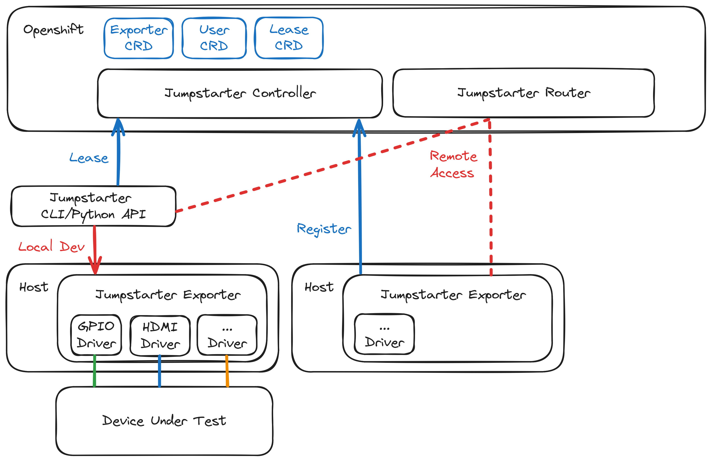
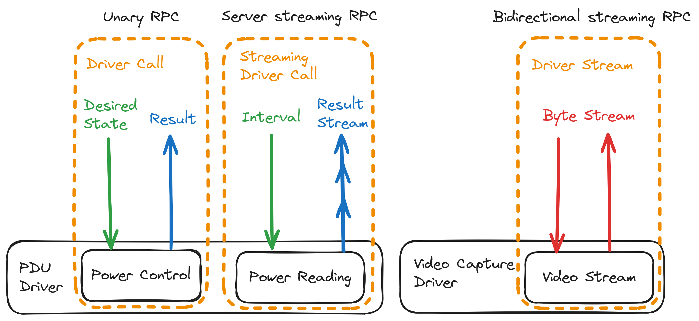
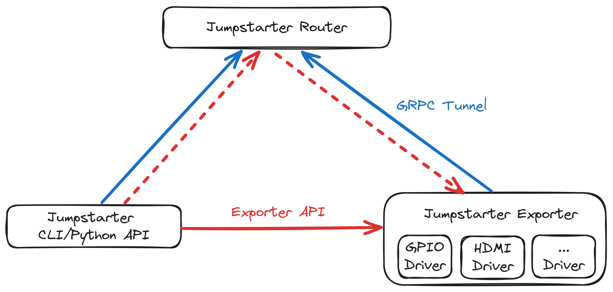

# Internals

## Architecture

Jumpstarter consists of primarily three components, the control plane (`Controller` and `Router`) running inside a kubernetes cluster, the `Exporter` running on dedicated `Exporter Hosts` or developer machines (for local development workflow), and the `Client` interacting with the `Exporter`.

The `Controller` handles inventory/lease management and access control, and stores its states as kubernetes CRDs. The `Router` provides a rendezvous point for clients to connect to exporters not on the local network. THe `Exporter` interacts with the `Device Under Test` with a set of `Drivers`, and exposes the methods provided by the `Drivers` over the network. The `Client` connects to the `Exporter` either directly, or over the `Router`, and calls the methods provided by the `Drivers` to perform actions on the `Device Under Test`.

## RPC

Jumpstarter in its essence, is a RPC framework for `Clients` to call methods provided by `Drivers`. `Drivers` can expose three styles of RPCs, `Unary`, `Server streaming` and `Bidirectional streaming`, which are implemented with their counterparts in `gRPC`, see [RPC life cycle](https://grpc.io/docs/what-is-grpc/core-concepts/#rpc-life-cycle) for an in depth introduction to these RPC types.

On top of `Bidirectional streaming` RPC, Jumpstarter also implements a generic byte stream interface, similar to TCP, for tunneling existing protocol (e.g. SSH) over Jumpstarter.

## Router

The Jumpstarter `Router` is just like ngrok or Cloudflare Tunnel, it allows for the `Client` to connect to `Exporters` without public IP addresses or behind NATs/firewalls, by tunneling a byte stream over Bidirectional streaming gRPC.

