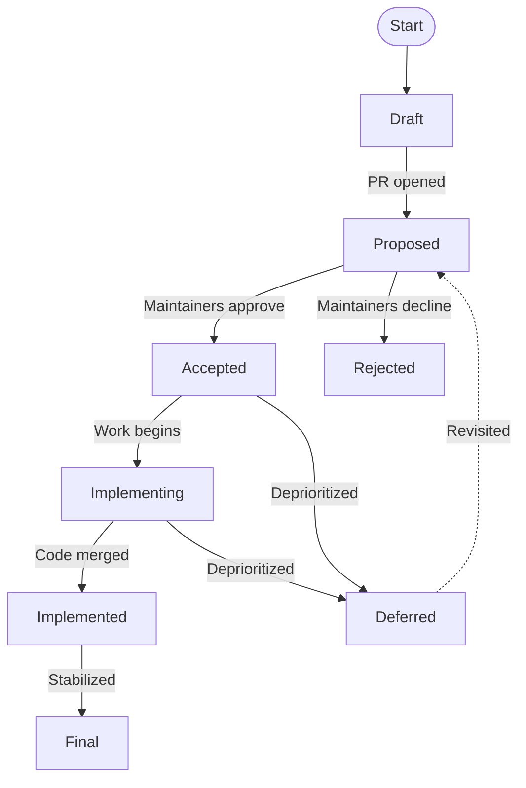

# JEP-0000: Jumpstarter Enhancement Proposal Process

| Field            | Value                                              |
|------------------|----------------------------------------------------|
| **JEP**          | 0000                                               |
| **Title**        | Jumpstarter Enhancement Proposal Process            |
| **Author(s)**    | Jumpstarter Maintainers                             |
| **Status**       | Active                                              |
| **Type**         | Process                                             |
| **Created**      | 2026-04-06                                          |
| **Discussion**   | [Matrix](https://matrix.to/#/#jumpstarter:matrix.org) |

## Abstract

This document defines the Jumpstarter Enhancement Proposal (JEP) process — the
mechanism by which substantial changes to the Jumpstarter project are proposed,
discussed, and decided upon. JEPs provide a consistent, transparent record of
design decisions for the Jumpstarter hardware-in-the-loop (HiL) testing framework
and its ecosystem of drivers, CLI tools, operator components, and protocol
definitions.

## Motivation

As Jumpstarter grows in contributors, drivers, and production deployments, the
project needs a structured way to propose and evaluate changes that go beyond
routine bug fixes and minor improvements. An informal "open a PR and see what
happens" approach doesn't scale when changes touch hardware interfaces, gRPC
protocol definitions, operator CRDs, or the driver plugin architecture — areas
where mistakes are expensive to reverse.

The JEP process gives the community:

- **Visibility** — a single place to discover what's being proposed, what's been
  decided, and why.
- **Structured discussion** — a template that forces authors to think through
  motivation, hardware implications, backward compatibility, and testing before
  code is written.
- **Historical record** — versioned markdown files in the repository whose git
  history captures the evolution of each proposal.
- **Inclusive governance** — a lightweight, PR-based workflow that any contributor
  can participate in, regardless of commit access.

## What Requires a JEP

Not every change needs a JEP. Use the following guidelines:

**A JEP is required for:**

- New features or subsystems in the core framework (e.g., a new lease scheduling
  strategy, a new exporter transport mechanism).
- Changes to the gRPC protocol (`.proto` files) or the operator CRD schema.
- New driver interface contracts or modifications to existing driver base classes.
- Changes to the `jmp` CLI that alter user-facing behavior in breaking ways.
- Introduction of new infrastructure requirements (e.g., requiring a new
  Kubernetes operator dependency, adding a new container runtime assumption).
- Significant changes to the packaging or distribution model (e.g., modifying the
  `packages/` monorepo structure, changing the private package index behavior).
- Process or governance changes (like this JEP itself).

**A JEP is NOT required for:**

- Bug fixes and minor patches.
- New drivers that follow the existing driver scaffold and don't modify framework
  interfaces (use the standard driver contribution workflow instead).
- Documentation improvements.
- Dependency version bumps (unless they introduce breaking changes).
- Refactoring that doesn't change public APIs.
- Test improvements.

When in doubt, ask in [Matrix](https://matrix.to/#/#jumpstarter:matrix.org) or
open a GitHub issue to gauge whether your idea warrants a JEP.

## JEPs and Architecture Decision Records (ADRs)

The project uses both JEPs and Architecture Decision Records (ADRs). They serve
different purposes and operate at different scopes:

| Aspect        | JEP                                        | ADR                                               |
|---------------|--------------------------------------------|----------------------------------------------------|
| **Scope**     | Cross-cutting changes to the project       | Scoped to a single component or driver              |
| **Process**   | Requires community review and maintainer approval | Included with the implementation PR                |
| **When**      | Before implementation begins               | Alongside or within an implementation PR            |
| **Location**  | `docs/internal/jeps/` directory             | `docs/internal/adr/` directory                      |
| **Example**   | New lease scheduling strategy              | Choice of telnet vs pyrenode3 for Renode driver     |

**Use a JEP** when the change affects multiple components, changes public APIs or
protocols, or requires community consensus. **Use an ADR** when you are making a
significant technical decision within a self-contained piece of work (e.g., a new
driver) that does not need project-wide review but should be documented for
posterity.

JEPs borrow the structured decision format from ADRs: each design decision in a
JEP should document alternatives considered and rationale, following the `DD-N`
pattern in the [JEP template](JEP-NNNN-template.md).

## JEP Types

| Type               | Description                                                                                            |
|--------------------|--------------------------------------------------------------------------------------------------------|
| **Standards Track** | Proposes a new feature or implementation change. Results in new or modified code, protocol definitions, or CRDs. |
| **Informational**   | Provides guidelines, background, or describes an issue without proposing a specific change. Does not require community consensus to adopt. |
| **Process**         | Proposes a change to the Jumpstarter development process, governance, or workflow (like this JEP).       |

## JEP Lifecycle



> **Note:** A JEP can move to **Withdrawn** from any pre-Final status
> (at the author's discretion) and to **Superseded** from any status
> (when replaced by a newer JEP). These transitions are omitted from
> the diagram for clarity.

| Status           | Meaning                                                                                  |
|------------------|------------------------------------------------------------------------------------------|
| **Draft**         | Author is still writing the JEP. Not yet open for formal review.                         |
| **Proposed**      | JEP PR is open and under community discussion.                                           |
| **Accepted**      | Maintainers have approved the design. Implementation may begin.                          |
| **Implementing**  | Implementation is in progress. The JEP may be updated with implementation learnings.     |
| **Implemented**   | Reference implementation is complete and merged.                                          |
| **Final**         | JEP is complete and considered the authoritative record of the feature.                  |
| **Rejected**      | Maintainers have declined the proposal. The JEP remains as a record of the decision.     |
| **Deferred**      | Proposal is sound but not a current priority. May be revisited later.                    |
| **Withdrawn**     | Author has voluntarily withdrawn the proposal.                                            |
| **Superseded**    | Replaced by a newer JEP. The `Superseded-By` field indicates the replacement.            |

A JEP can move to **Withdrawn** from any pre-Final status. A JEP can move to
**Superseded** from any status.

## JEP Workflow

### 1. Socialize the Idea

Before writing a JEP, discuss the idea informally:

- Start a thread in [Matrix](https://matrix.to/#/#jumpstarter:matrix.org).
- Add it to the agenda for the [weekly meeting](https://meet.google.com/gzd-hhbd-hpu).
- Open a GitHub issue labeled `jep/discussion` for early feedback.

This step helps determine whether a JEP is warranted, identifies potential
reviewers, and surfaces obvious concerns early.

### 2. Submit a JEP Pull Request

Create a new branch and add your JEP as a markdown file in the `docs/internal/jeps/`
directory, following the [JEP template](../docs/internal/jeps/JEP-NNNN-template.md). Open a pull
request against the main branch. The PR-based workflow makes discussion
easier through inline review comments and suggested changes.

The JEP title should follow the format:

```text
JEP: Short descriptive title
```

The JEP number is an incrementing integer assigned sequentially (e.g.,
JEP-0010, JEP-0011, JEP-0012). It is not derived from the PR number.
To determine the next available number, check the existing JEPs in the
`docs/internal/jeps/` directory and increment from the highest existing number.
Apply the `jep` label to the pull request.

Fill in every section of the template. Sections marked `(Optional)` may be
omitted if not applicable, but all required sections must be present. Set
the JEP status to **Proposed** when the PR is ready for review.

### 3. Discussion and Revision

The community reviews the JEP on the pull request. PRs are the preferred
venue for discussion, as they allow inline review comments on the JEP text
itself. The author is expected to:

- Respond to feedback and revise the JEP accordingly.
- Build consensus, especially among contributors who would be affected by the
  change.
- Document dissenting opinions in the **Rejected Alternatives** section.

### 4. Decision

Jumpstarter maintainers make the final decision to accept or reject a JEP.
Decisions are recorded as a comment on the pull request with a rationale. The
author updates the JEP status in the markdown file.

JEPs should always be merged as PRs so the markdown documentation is
incorporated directly into the Jumpstarter docs/source. Rejected JEPs are
normally not merged as PRs. However, if there is an architectural reason to
preserve a rejected JEP in the repository (e.g., to document why an approach
was not taken for future reference), it may be merged with a **Rejected**
status clearly set in the metadata.

### 5. Implementation

Once accepted, the author (or any willing contributor) implements the feature.
Implementation PRs should reference the JEP (e.g., `Implements JEP-0400`).
The JEP's **Implementation History** section should be updated with links
to relevant PRs as they are merged. The JEP moves through Implementing →
Implemented → Final as work progresses.

## Roles

| Role            | Responsibility                                                                               |
|-----------------|----------------------------------------------------------------------------------------------|
| **Author**       | Writes the JEP, responds to feedback, shepherds the proposal through the process.            |
| **Reviewer**     | Provides technical feedback on the pull request. Any community member can review.             |
| **Maintainer**   | Makes the final accept/reject decision. Must provide written rationale.                      |
| **Implementer**  | Writes the code. Often the author, but doesn't have to be.                                   |

## JEP Numbering

JEP numbers are incrementing integers assigned sequentially. They are not
derived from the pull request number. Once assigned, a JEP number is never
reused. JEP-0000 through JEP-0009 are reserved for process and meta-JEPs.

## JEP Index

The file `docs/internal/jeps/README.md` serves as the index of all JEPs.
Alternatively, all JEPs can be found by filtering GitHub pull requests with
the `jep` label.

## Amendments to This Process

Changes to the JEP process itself require a new Process-type JEP.

## Prior Art

This process draws inspiration from:

- [Python Enhancement Proposals (PEPs)](https://peps.python.org/pep-0001/) —
  lightweight metadata, champion model, clear status lifecycle.
- [Kubernetes Enhancement Proposals (KEPs)](https://github.com/kubernetes/enhancements/tree/master/keps) —
  test plan requirements, graduation criteria, production readiness.
- [Rust RFCs](https://github.com/rust-lang/rfcs) — PR-based workflow, emphasis
  on motivation and teaching, prior art section.
- [Architecture Decision Records (ADRs)](https://adr.github.io/) — structured
  decision documentation with context, alternatives, and consequences. The JEP
  template adopts the ADR pattern for individual design decisions.
- [GitHub SpecKit](https://github.com/github/spec-kit) — spec-driven development
  methodology with structured templates and agent-friendly document conventions.
  The JEP template adopts SpecKit's practice of marking sections as mandatory or
  optional and structuring documents for machine readability.

## Copyright

This document is placed under the
[Apache License, Version 2.0](https://www.apache.org/licenses/LICENSE-2.0),
consistent with the Jumpstarter project license.
