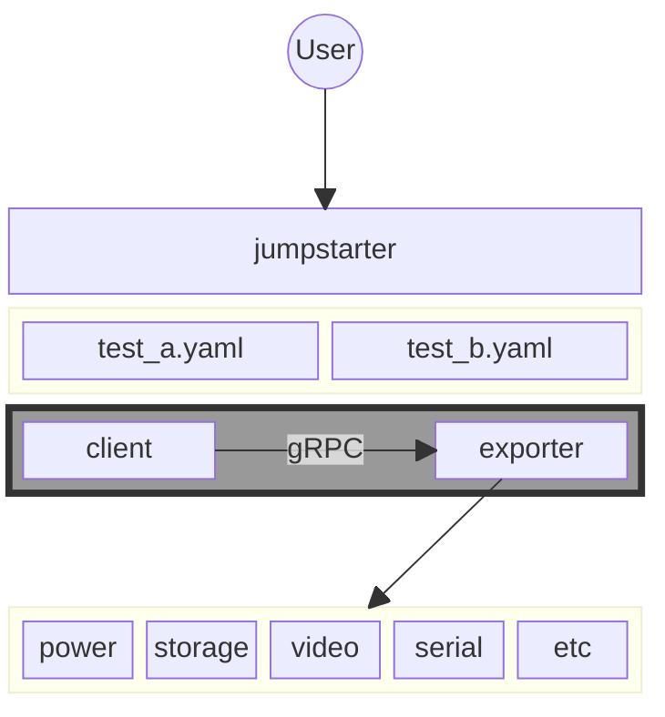
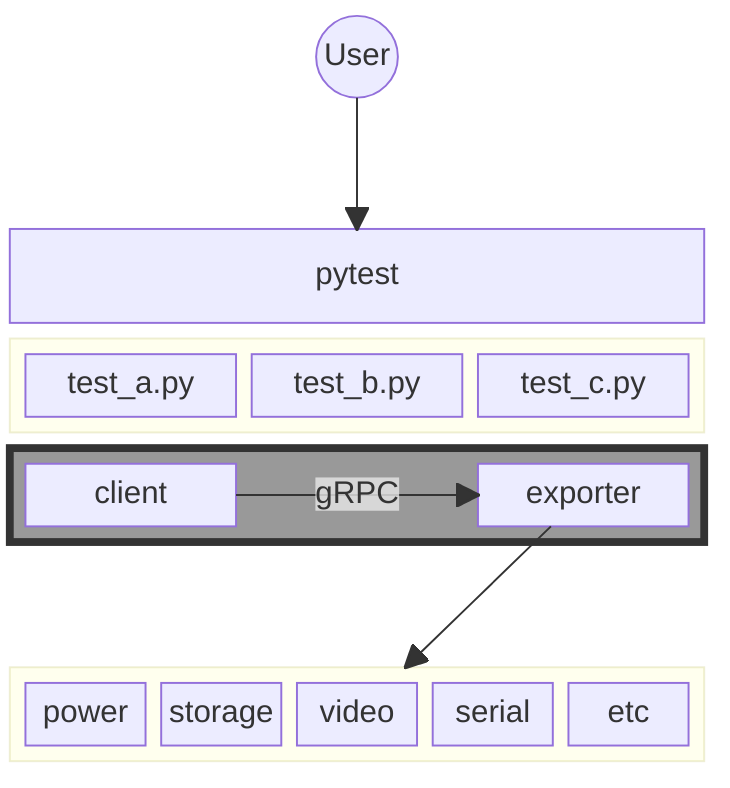
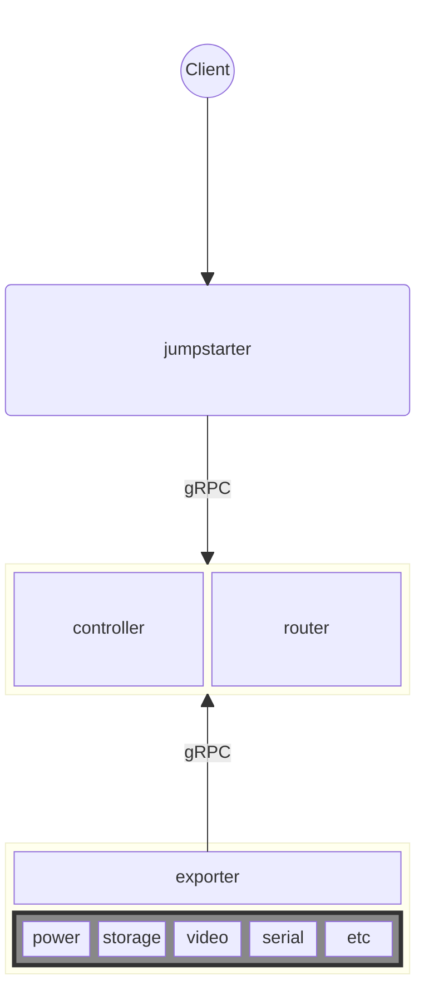

# Jumpstarter Architecture

The Jumpstarter architecture is based on a client/server model. This enables a
single client to communicate with one or many devices under test.

Devices can either be connected to the same machine as the client or distributed
across remote test runners, for example, in a hybrid cloud CI environment.

The core of this architecture is the
[gRPC protocol](https://github.com/jumpstarter-dev/jumpstarter-protocol/tree/main/proto/jumpstarter/v1)
that connects a client to a device, either directly, or through a central server.

## Components

### [`jumpstarter-python`](https://github.com/jumpstarter-dev/jumpstarter-python/)

#### Device Under Test (DUT)

The DUT is the device that is being tested by Jumpstarter. One or more devices
can be connected to a single exporter instance so they are treated as a single
unit that can be tested together.

#### Exporter

The exporter is a service that can run locally or on another Linux device that
"exports" the interfaces connected to the Device Under Test (DUT). The exporter
implements a gRPC service (exposed via a unix socket) that a client can connect
to directly or through a proxy server to interact with a specific device.

#### Driver

Jumpstarter drivers are exporter plugins that provide the ability to interact with
a specific device. Drivers provide an interface that can be interacted with
either through Python (as a library) or the CLI.

#### Client

The Jumpstarter client is a Python library and CLI tool that can connect to one
or more exporters either locally through socket or remotely through a central server.

#### Tests

Tests are any test scripts written in Python or YAML that utilize the
CLI or Python library to interact with hardware via Jumpstarter. Basic tests
can be written as YAML steps, while more complex testing can take full advantage
of Jumpstarter as a library through Python.

### [`jumpstarter-controller`](https://github.com/jumpstarter-dev/jumpstarter-controller/)

To provide compatibility with many existing Kubernetes-based tools (such as Helm)
and CI systems (such as Tekton), Jumpstarter server components are implemented
as Kubernetes services.

Jumpstarter uses Kubernetes primitives and [Custom Resource Definitions (CRDs)](https://kubernetes.io/docs/concepts/extend-kubernetes/api-extension/custom-resources/)
to manage the state of resources such as clients, exporters, and leases.
When a new client or exporter is registered, a resource is created in the
cluster to keep track of its state similar to how nodes and pods are managed.

#### Controller

The controller service manages the client leases on exporter
instances and keeps track of the connected clients and exporters.

The `jumpstarter-controller` is a Kubernetes [controller](https://github.com/jumpstarter-dev/jumpstarter-controller)
which provides the reconciliation of CRD resources. This service also provides a
gRPC API used by clients to acquire leases on exporters.

#### Router

The router service faciliates routing of messages between the [clients](#client)
and [exporters](#exporter).

The `jumpstarter-router` provides routing via gRPC streams.

## Authentication

Client and Exporter authentication is managed via JWT tokens provided by the
`TokenRequest`and `TokenReview` Kubernetes APIs under the `jumpstarter-controller`
service account, the audience field indicates the location of the Jumpstarter
gRPC endpoint.

This authentication mechanism makes it possible to dynamically register different
Jumpstarter clients and exporters to communicate through the server.
For example, a CI-based client can be registered and authorized to access
hardware resources exported from a specific lab of test benches.

## Jumpstarter Commands

```bash
jumpstarter power on device
```

## Running Tests Locally (without a server)

When no client configuration or environment variables are present, Jumpstarter
will run in local mode and communicate with a built-in exporter service
(or a registered daemon) via the local socket connection.

This mode enables easy development of tests and drivers without having to configure
a local k8s cluster using a tool such as [Kind](https://kind.sigs.k8s.io/).

### YAML Tests



### Python Tests

```bash
pytest test_a.py
```



## Running tests through a central controller

