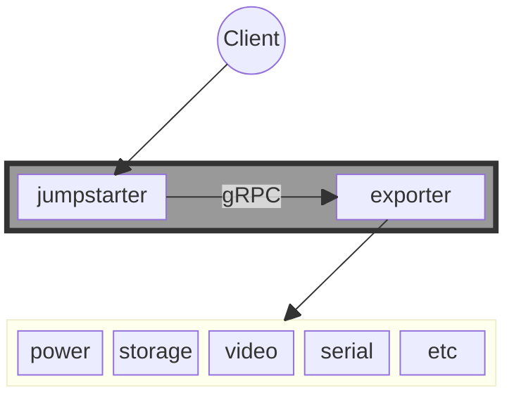
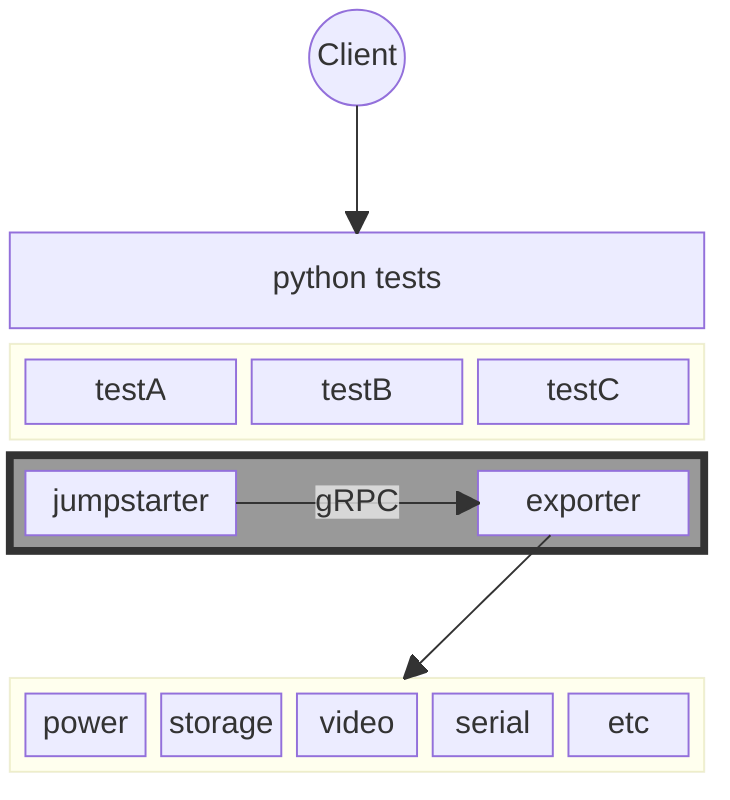
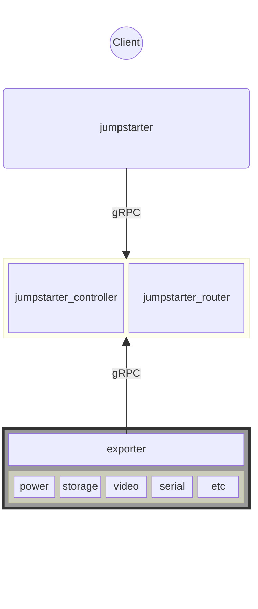

# Jumpstarter architecture

The jumpstarter architecture is constructed around a
[gRPC protocol](https://github.com/jumpstarter-dev/jumpstarter-protocol/tree/main/proto/jumpstarter/v1) that connects the client to the exporters, either directly, or through a central server.

The exporters implement a gRPC service (exposed via unix socket), a local client talks directly to this exporter service, and optionally a client that connects to a central server.

The client can connect to a central server that manages the leases and the inventory of exporters and clients, also facilitates routing to the exporter
gRPC service.


## Jumpstarter Router and Controller

The jumpstarter-router and controller services live in this repository
[jumpstarter-router](https://github.com/jumpstarter-dev/jumpstarter-router/).

* `jumpstarter-controller` provides the reconciliation of CRD resources like Exporters
  and Clients/Identities. Also provides the gRPC to perform exporter leases.

* `jumpstarter-router` provides the client-to-exporter routing via gRPC streams.

## Authentication

Client and Exporter authentication is managed via JWT tokens provided by the TokenRequest
and TokenReview k8s APIs under the `jumpstarter-controller` account, the audience field
of the token provides the reference to the jumpstarter gRPC endpoint.


## Running tests locally (without a server)

When no client configuration or environment variables are set, the client will
run in local mode and will use the local resources. Know hardware could be
auto-detected and used by the client, but specific hardware can be configured
with an environment python file.

### Jumpstarter commands

```bash
jumpstarter power on device
```





### Python based tests

```bash
pytest my_jumpstarter_based_test.py
```




## Running tests through a central controller


