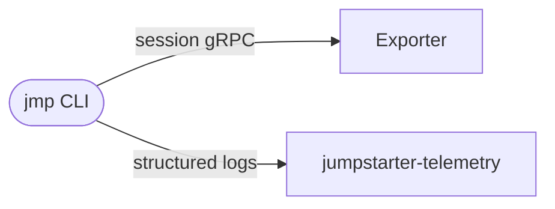
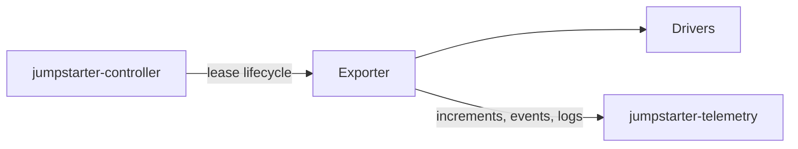
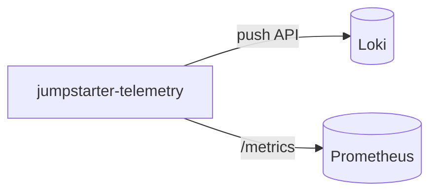
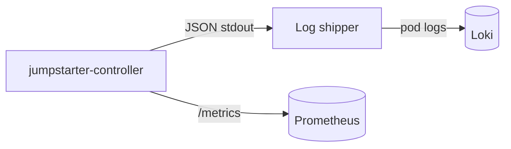
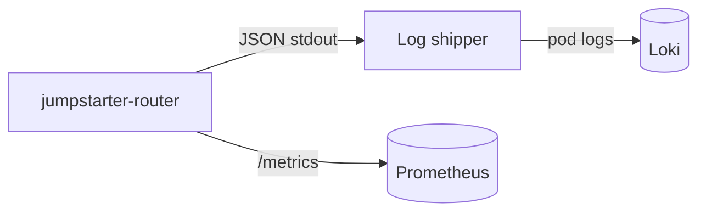

# JEP-0011: Metrics, Tracing, and Log Observability

| Field             | Value                                                                 |
| ----------------- | --------------------------------------------------------------------- |
| **JEP**           | 0011                                                                  |
| **Title**         | Metrics, Tracing, and Log Observability                               |
| **Author(s)**     | @mangelajo (Miguel Angel Ajo Pelayo)                                  |
| **Status**        | Draft                                                                 |
| **Type**          | Standards Track                                                       |
| **Created**       | 2026-04-23                                                            |
| **Updated**       | 2026-04-23                                                            |
| **Discussion**    | *TODO: Matrix thread or GitHub issue/PR when opened*                  |
| **Requires**      | —                                                                     |
| **Supersedes**    | —                                                                     |
| **Superseded-By** | —                                                                     |

---

## Abstract

This JEP defines an optional, cross-component observability model for
Jumpstarter covering lease context metadata, structured operational events,
exporter/driver metrics, and standardized logging. It targets direct integration
with Prometheus (scrape), Loki (log aggregation), and Perses (dashboards) —
without mandating OpenTelemetry — and introduces an optional in-cluster
Jumpstarter Telemetry service that aggregates data from exporters and clients so
that edge processes never need Loki or cluster-scrape credentials.
Implementation is expected to land in phases; this JEP describes the end state
and compatibility rules.

## Motivation

Today, operators and CI maintainers need to answer questions that raw Kubernetes
objects and ad hoc text logs do not always answer in one place:
- *Which pipeline or image was being tested on this lease?*
- *How often do flashes fail on this exporter?*
- *What lease or user correlates a controller line with a failure on the client?* 

The `Lease` API already models scheduling and assignment; it does
not yet provide a first-class, documented place for run metadata or a standard
for lease-scoped operational events (beyond generic `conditions`).

Exporters expose work to drivers, but there is no shared model for driver- or
exporter-level metrics that a monitoring stack can scrape or receive.

### User Stories

- **As a** lab operator, **I want to** see flash success/failure rates per
  exporter in a Prometheus dashboard, **so that** I can spot failing hardware
  before CI teams notice.
- **As a** CI pipeline author, **I want to** attach my build ID and image
  digest to a lease, **so that** post-mortem queries in Loki can filter all
  logs for one pipeline run across controller, exporter, and client.
- **As a** platform engineer, **I want** exporter processes to send telemetry
  without holding Loki or Prometheus credentials, **so that** I do not have to
  distribute and rotate secrets on every lab machine.

## Proposal

### Concepts

- **Lease context** — Identifiers and labels supplied by a client or CI and
  associated for the life of a lease, propagated where safe so metrics, logs,
  and traces can be filtered and joined.
- **Lease events** (or *operations*) — Annotated, structured log entries
  recording significant actions (for example *flash started*, *flash failed*,
  *image reference*) with typed fields, queryable in **Loki** alongside
  regular logs and distinct from higher-frequency debug output (see **DD-2**).
- **Exporter metrics** — Counters, histograms, and gauges (naming and labels
  TBD) exposed from the exporter and optionally enriched by individual drivers
  (for example storage operations per type).
- **Jumpstarter Telemetry** (optional) — a dedicated
  component with a well-known ingest path and the same trust
  model (mTLS, ServiceAccount) as Controller/Router;
  it isolates Loki/series work from the reconciler hot path (see
  **DD-7**). Multi-replica HA and PromQL `sum` aggregation are
  covered in **DD-8**; best-effort idempotency for informative metrics in
  **DD-9**.

### What users see

- When creating a lease, clients (or their tooling) can attach metadata via
  CRD fields and/or `spec.context` using documented
  keys and size limits. Example keys might include a build / pipeline
  identifier, image digest, or VCS.
- The controller and/or data plane write structured, annotated log events
  (see **DD-2**) for significant operations such as flash attempts and outcomes.
- Exporters send increments to the Jumpstarter Telemetry
  service over the existing exporter↔control-plane trust boundary;
  the in-cluster side then POSTs to Loki and exposes `/metrics`
  for scrape (see **DD-3**, **DD-7**), with cluster credentials, avoiding
  per-exporter Loki and metrics secrets. The same path can carry operator-chosen structured log lines
  and events (not unbounded default client chatter — see *Control-plane
  aggregation* below).
- The `jmp` CLI logs remain readable, but also submits logs through the jumpstarter telemetry
  endpoint, in machine parseable format for loki ingest.

### API / Protocol Changes

*High level — to be refined during review.*

- **CRD (Lease)**: Additive changes only for the `spec.context` field. Backwards
  compatibility by making this field empty by default.
- **gRPC (if applicable)**: Additional controller methods to discover the availability
  of a metrics, or set of metrics endpoint(s). Optional propagation of `traceparent` and lease
  identifiers in metadata; must remain backward compatible for existing clients
  (unknown metadata ignored by older servers).

### Hardware Considerations

- No hardware considerations.

## Design Decisions

### DD-1: How lease-scoped *context* metadata is stored

**Scope:** This decision is about where to store generic metadata on a
`Lease` that describes *why* a run exists or *where* it came from — for example
an external build id, pipeline id, VCS revision, or other
operator-defined keys (team, environment), within the cardinality and
size limits defined in *Cardinality guidelines*. The same stored context
is the intended source to propagate (where safe) into metric series
labels and into log line fields for emissions that occur during the
lease and for logs produced during client access to the platform
(for example `jmp`) or during exporter and control-plane handling, so
Prometheus and Loki can correlate on one lease-level
identity without re-typing it on every line.

**Alternatives considered:**

1. **Annotation and label only** on the `Lease` object — Kube-native, no spec
   change; limited size for annotations; labels for select queries only.
2. **Typed subfields under `spec`** (for example `observability` or `context`)
   — easier validation, clearer API, migration path in CRD.
3. **Only client-side** (environment / local config) — no cluster visibility;
   hard for operators to audit; no stable object-level link to per-lease
   metrics and server logs in the cluster.

**Decision:** the JEP leans toward **(2) for first-class, validated context**
with **(1) allowed for integration with generic tooling**, pending contributor consensus.

**Rationale:** Typed fields make validation and documentation clear; labels
are still useful for selection and for tools that only understand metadata.

### DD-2: Where operational events (flash, image) live

**Alternatives considered:**

1. **Kubernetes `Event` objects** — built-in, TTL-limited, good for
   "what happened" in `kubectl get events` but not long-term history by default.
2. **`Lease.status.conditions` only** — compact but poor for a sequence of
   operations with payloads (image id, size).
3. **Dedicated CRD** (for example per-event or a single stream object) — more
   design and RBAC, better long-term retention and querying if backed properly.
4. **Annotated log events** Provides a lightweight alternative that can be traced
   and filtered along logs.

**Decision:** (4), since the other alternatives add additional pressure to the cluster
   etcd via CRDs, annotated logs still provide the same level of functionality and can
   be browsed together with logs.

**Rationale:** Annotated log events naturally flow through the Loki
  pipeline this JEP already establishes (**DD-5**, **DD-7**), so operational
  records (flash started, flash failed, image reference) are queryable,
  filterable, and correlated with surrounding exporter and controller logs
  using the same label set (`lease_id`, `exporter`, `result`, …) without a
  second query domain. Kubernetes `Event` objects **(1)** have a short
  default TTL (~1 h) and still write to etcd on every occurrence;
  `status.conditions` **(2)** is a poor fit for a sequence of operations with
  variable payloads (image digest, byte count, duration); a dedicated CRD
  **(3)** adds schema versioning, RBAC surface, and per-event etcd writes
  that scale with flash volume — all pressure the cluster does not need
  for data whose primary consumers are dashboards and post-mortem
  queries, not reconciliation loops. Structured log events carry arbitrary
  fields without CRD migration, support configurable retention in Loki,
  and keep the etcd write budget reserved for scheduling and assignment
  where it matters most.

### DD-3: Metrics: Prometheus scrape of `/metrics` as the reference path

**Alternatives considered:**

1. **HTTP `GET /metrics` in Prometheus text format** (pull) — the default
   for in-cluster Prometheus in scrape mode; works
   with the Prometheus Operator (`ServiceMonitor`), `kube-prometheus`, and
   self-hosted jobs. The optional Jumpstarter Telemetry service exposes
   this for aggregated counters it holds after receiving +1 / +N
   from exporters.
2. **Prometheus remote write** (or a Mimir / Cortex receiver)
   from a Jumpstarter component — useful in advanced topologies; not
   part of the reference implementation in this JEP; operators can add a
   federation or `remote_write` from Prometheus to long-term
   storage without the application pushing to Prometheus.
3. **Both** — **(1)** is required for the documented path; **(2)** is
   optional infrastructure behind Prometheus, not a second
   required app protocol.

**Decision:** **(1)** for how cluster Prometheus ingests Jumpstarter
  aggregated metrics (scrape the Telemetry, Controller,
  and Router services).

**Rationale:** Scrape is standard, debuggable, and scalable; it matches
  `ServiceMonitor`; it avoids app-side remote-write credentials and
  complexity in Jumpstarter. See **DD-6** (no OTel), **DD-7** (Telemetry
  Deployment), **DD-8** (HA replicas).

### DD-4: Log format for services vs CLI

**Alternatives considered:**

1. **JSON always** for every process — best for machines; hard for humans
   debugging a laptop.
2. **Human text default for `jmp`**, **JSON for long-running services** and an
   optional cli push via the metrics endpoint in JSON format (in addition to the
   human friendly output)
3. **Single format** with a pretty-printer in front of developers — more moving
   parts.

**Decision:** **(2)**. Long-running services (`jumpstarter-controller`,
  `jumpstarter-router`, `jumpstarter-telemetry`, Exporter) emit
  structured JSON to stdout. The Controller and Router do not
  push logs directly to Loki; instead, a cluster-level log shipper
  (Promtail, Grafana Alloy, Vector, or equivalent DaemonSet) scrapes their
  pod logs and delivers them to Loki. Only `jumpstarter-telemetry` writes
  to Loki directly (push API) because the exporter/client data it
  aggregates does not originate as any pod's stdout.

**Rationale:** Matches the requirement that *clients* stay human-readable, and at
  the same time all services get parseable, joinable log lines. Writing JSON
  to stdout and relying on the cluster log shipper for Loki delivery
  decouples the Controller reconciler and Router session handling from
  Loki availability — a Loki outage does not affect lease operations.
  The Telemetry service retains a direct Loki-push because it is an
  isolated workload (**DD-7**) whose core job is Loki ingest.

### DD-5: Where Loki and Prometheus (or remote-write) credentials live

**Alternatives considered:**

1. **Each exporter and edge host** holds credentials (or a sidecar) to push
   directly to Loki and to Prometheus (or a metrics gateway) — maximum
   flexibility; maximum secret distribution and rotation burden on lab and
   remote sites.
2. **Jumpstarter Controller and/or Router** receive metrics and structured
   events from exporters and (optionally) from client traffic they already
   handle, and forward to the Loki push API and to
   Prometheus-compatible sinks (scrape registration)
   with in-cluster auth — one
   credential surface; enriched with lease, exporter, and client context
   in one place; must be non-blocking, bounded, and optional so the
   control path does not depend on Loki or Prometheus availability.
3. **Hybrid** — generic in-cluster collectors for raw pod logs and scrape;
   (2) for lease-scoped events and aggregated exporter metrics the
   platform understands.
4. **Dedicated Jumpstarter Telemetry Deployment** (see **DD-7**)
   instead of folding everything into the Controller — only
   Telemetry holds Loki-push credentials; isolated failure domain
   and scaling for high-volume increments. Router and Controller
   write structured JSON to stdout (see **DD-4**) and expose `/metrics`
   for Prometheus scrape; a cluster log shipper delivers their pod logs
   to Loki without Jumpstarter-specific Loki credentials.

**Decision:** (4)

**Rationale:** The goal is to avoid propagating Loki- and
  cluster-ingest authentication
  to every exporter process while still attaching Jumpstarter-specific
  context. Among Jumpstarter components, only `jumpstarter-telemetry`
  holds Loki-push credentials — the Controller and Router have no Loki
  client dependency (see **DD-4**); their pod logs reach Loki via the
  cluster's existing log shipping infrastructure. Generic in-cluster
  collectors solve *credentials* but not *semantic* correlation unless
  integrated; the hub (2) reuses the existing trust model
  (exporter→controller) and can inject labels and tenant headers (for
  example `X-Scope-OrgID`) in one place. A separate Deployment (**4** /
  **DD-7**) is preferable to overloading the main reconciler when
  load or residency of counters matters.

### DD-6: OpenTelemetry (OTLP / Collector) as a *mandated* layer

**Alternatives considered:**

1. **Adopt OpenTelemetry** — instrument Controller, Router, Exporter, and
   clients with the OTel SDK, export OTLP to a cluster-local
   OpenTelemetry Collector, and let the Collector fan out to Loki, Prometheus
   (remote write), and Tempo.
2. **Integrate directly** with each backend: Loki HTTP `POST /loki/api/v1/push` or
   gRPC; Prometheus text on `/metrics`; structured JSON
   (or logfmt) logs to stdout for shippers; optional W3C `traceparent` in
   gRPC metadata for correlation *without* shipping full distributed
   traces in the first iteration. If traces are ever needed, use Tempo
   ingest where practical, *or* a thin sender — still
   without a project-wide requirement on the OTel SDK in every binary.
3. **Hybrid (OTel in one language, direct in another)** — lowest common
   implementation cost but inconsistent contributor experience and two
   operational models.

**Decision:** **(2).** This JEP does not make OpenTelemetry (SDK or
  Collector) part of the required reference architecture. Vendors and
  operators who already run an OpenTelemetry Collector may scrape the
  same `/metrics`, receive logs shipped by existing agents, or
  receive the Loki body the hub would have sent — compatibility
  is welcome; dependency is not mandatory.

**Rationale:**

- **Complexity** — the Collector is another versioned, configured service; dual
  OTel stacks (Go, Python) add version drift and test matrix.
- **Fit** — most Jumpstarter metrics and lease events map cleanly to
  Prometheus and Loki wire protocols operators already use.
- **Narrow scope** — full three-pillar OTel (unified logs via OTLP) is
  *optional product territory*; this JEP optimizes for low ceremony and
  direct integration.

### DD-7: Optional Jumpstarter Telemetry service (dedicated Deployment vs. Controller/Router only)

**Alternatives considered:**

1. **In-process** in the Controller (and Router) reconciler — few
  moving parts; risk of CPU / GC pressure and stronger coupling
  between leases and high-volume increments or Loki writes.
2. A **dedicated** in-cluster Service and Deployment (working name
   `jumpstarter-telemetry`, TBD) that: receives gRPC/HTTP increments from
   exporters and clients, applies them to counters in memory,
   POSTs to Loki, exposes `/metrics`, and uses the same K8s
   ServiceAccount / mTLS as other control-plane binaries.
3. **Split** into separate sidecars (Loki-only, metrics-only) — more images to
   build and version.

**Decision:** Prefer **(2)** for the optional aggregated-metrics + Loki
  path at scale; allow **(1)** in small or dev clusters; **(3)** only
  if review shows a need. Could still offer a centralized log/event source when
  Loki is not available by using the pod logs, this could be helpful for testing.

**Rationale:** A dedicated workload can scale and restart independently;
  Loki spikes and ingest load cannot starve lease
  reconciliation in the controller by moving it to a separate service.

### DD-8: Multiple Telemetry replicas (HA) and addable counters

**Context:** The Telemetry process holds in-memory counters. Exporters send
+1 (e.g. flash success), +N (bytes read/written), or +1 per
reporting interval (e.g. one “inactive” minute for a lease with
labels `exporter`, `lease_id`, `client`).

**Alternatives considered:**

1. **Single replica** for Telemetry — no cross-pod `sum` issue; SPOF for
  ingest and scrape of that `Service`.
2. **Multiple replicas** behind a load balancer; each RPC updates one
  pod, which only advances its partial counters for the label
  sets it has seen. Prometheus scrapes all pods (or separate
  `PodMonitor` targets). In PromQL,
  `sum by (exporter, lease_id, client, …) (…)` after dropping
  `pod` / `instance` matches the global total, as long as each real
  event is applied at most once in the system (counters are
  additive; increments are partitioned by traffic).
3. **Strong consistency** (Raft, Redis as source of truth for
  counters) — higher operating cost than this JEP’s v1 scope.

**Decision:** **(2)**

**Rationale:** Sums of cumulative counters across replicas are
  meaningful when each event is not double-applied; Loki
  appends are naturally per-replica as well. A possible failure mode is
  duplicate increments (retries, at-least-once RPCs). But this
  is informative data, and eventual (and very low chance) of duplication does not
  justify a more complex design — see **DD-9**.

### DD-9: Idempotency vs. best-effort (acceptable over-count for informative metrics)

**Alternatives considered:**

1. **Idempotent** increments (deduplication keys or idempotent RPCs) —
  appropriate for billing- or SLO-sensitive series; more design
  and storage in the ingest path.
2. **Best effort** (at-least-once) `+1` / `+N` without global deduplication
  — simpler; rare extra counts on retries or replays (see
  **DD-8**).
3. “Exactly once in the exporter; Telemetry is a dumb adder” —
  still **(2)** at the edge if the network retries.

**Decision:** (2)

**Rationale:** Simpler RPCs and no global dedup store in v1;
  operators treat these numbers as order-of-magnitude signals,
  not invoices, unless policy changes.

### DD-10: Perses over Grafana for dashboarding

**Alternatives considered:**

1. **Grafana** — mature, widely deployed, massive plugin and datasource
   ecosystem; governed by Grafana Labs (commercial); AGPL v3 license;
   custom JSON dashboard format; external to Kubernetes architecture.
2. **Perses** — CNCF project (vendor-neutral governance); Apache 2.0
   license; standardized dashboard spec (CUE/JSON) with built-in static
   validation and SDKs for GitOps; Kubernetes-native (CRD support for
   dashboards-as-code); data-source focus on Prometheus, Loki, and
   Tempo — exactly the backends this JEP targets.

**Decision:** **(2)**

**Rationale:**

- **License alignment** — Jumpstarter is Apache 2.0; recommending an
  AGPL-licensed dashboard layer introduces license friction for downstream
  distributors and embedders.
- **CNCF governance** — vendor-neutral stewardship matches the project's
  open-source posture; no single-vendor control over the dashboard layer.
- **Kubernetes-native CRDs** — dashboards can be managed as K8s resources,
  fitting the same declarative, reconciler-driven model Jumpstarter already
  uses for Leases, Exporters, and the optional Telemetry Deployment.
- **GitOps and validation** — CUE-based specs with static validation and SDKs
  enable dashboard-as-code in CI pipelines, consistent with the JEP's emphasis
  on automation and CI integration.
- **Backend focus** — Perses targets Prometheus, Loki, and Tempo — exactly the
  three backends this JEP standardizes on — without carrying the cost of a
  broad plugin ecosystem the project does not need.

Operators who prefer Grafana can still point it at the same `/metrics` and Loki
endpoints; this DD only governs the recommended dashboard experience.

## Design Details

### Correlation and fields

*Subject to review — names and cardinality rules should be fixed before
"Implemented".*

| Field / label | Prometheus metric label | Loki stream label | Log line field | Notes |
| ------------- | :--------------------: | :---------------: | :------------: | ----- |
| `exporter` | yes | yes | yes | Bounded by cluster size. |
| `operation` (flash, power, …) | yes | no | yes | Small fixed enum. |
| `result` (success, failure, …) | yes | no | yes | Small fixed enum. |
| `component` (controller, router, telemetry, exporter) | no | yes | yes | Fixed set of service names. |
| `namespace` | no | yes | yes | K8s namespace; bounded. |
| `lease_id` (or UID) | **no** | **no** | yes | Unbounded — use only in log line JSON. |
| `client` (identifier) | opt-in | **no** | yes | See *Cardinality guidelines*; avoid PII. |
| `image_digest`, `build_id`, VCS ref | **no** | **no** | yes | From `spec.context`; unbounded. |
| W3C `trace_id` / `span_id` | **no** | **no** | yes | Propagate in gRPC metadata and log lines. |

Additional `lease.spec.context` correlation fields can be added at runtime;
they appear as structured log line fields, never as Prometheus or Loki labels.

### Cardinality guidelines

Unbounded identifiers (`lease_id`, `image_digest`, `trace_id`, and
any operator-defined `spec.context` keys) must not be used as Prometheus metric
labels or Loki stream labels. They belong inside structured log line JSON,
where Loki filter expressions (`| json | lease_id = "…"`) can query them
without inflating the label index.

Rules of thumb for this JEP:

- **Prometheus**: each metric label dimension should have < 100 distinct values
  per scrape target. The default label set for Jumpstarter metrics is
  `{exporter, operation, result}` — all bounded enums.
- **Loki**: stream labels should be a small fixed set (`{component, exporter,
  namespace}`) to keep active stream count per tenant manageable (Grafana's
  guidance: < 100 k active streams). High-cardinality fields go inside the log
  line body.
- **Lease context fields** from `spec.context` are propagated into log line
  JSON only. A future implementation may allow operators to promote specific
  context keys to Loki stream labels at their own cardinality risk, but the
  default is log-line-only.

#### `client` label: opt-in two-tier strategy

Per-client metrics (e.g. flash failures by client) are valuable for operators
but `client` is a semi-bounded dimension whose cardinality depends on
deployment size. The JEP adopts a two-tier approach:

1. **Default (off)**: metrics use `{exporter, operation, result}` only.
   `client` appears in every structured log line, so per-client analysis is
   available via LogQL:
   `sum by (client) (count_over_time({component="exporter"} | json | operation="flash" [5m]))`.
2. **Opt-in**: an operator flag (e.g. `metrics.includeClientLabel: true`) adds
   `client` to the Prometheus label set. This is safe for deployments with a
   bounded, stable set of registered clients (rule of thumb: < 200). Operators
   with short-lived or ephemeral clients (CI runners, dynamic pods) should
   leave it off to avoid series churn.

Approximate series impact with 20 exporters, 4 operations, 2 results:

| Clients | Series per metric (without) | Series per metric (with) |
| ------- | :-------------------------: | :----------------------: |
| —       | 160                         | —                        |
| 150     | 160                         | 24,000                   |
| 1,000   | 160                         | 160,000                  |

At 150 clients and ~10 metrics the total (~240 k series) is well within a
single Prometheus instance. At 1,000 clients the total (~1.6 M series) is
feasible but approaches the range where long-term retention benefits from
Thanos or Mimir, and series churn from ephemeral clients can degrade
compaction.

Future work may explore Prometheus exemplars (attaching `client` to individual
samples without creating full series) as a low-cardinality alternative for
"which client caused this spike?" queries.

### Control-plane aggregation (Controller / Router / optional Telemetry)

When this mode is enabled in a deployment:

- Exporters and clients (`jmp`) send increments (`+1` /
  `+N`) and structured log/event records to the optional
  `jumpstarter-telemetry` service (name TBD, see **DD-7**). This dedicated
  `Service` uses the same mTLS / ServiceAccount / NetworkPolicy model as
  Controller and Router; it holds in-memory counters, POSTs to
  the Loki API, and exposes `/metrics` for Prometheus scrape
  (**DD-3**). HA (multiple replicas) uses `sum` in PromQL (**DD-8**);
  best-effort duplicate tolerance (**DD-9**). Exporter and edge processes never
  need Loki or cluster-scrape credentials directly (**DD-5**).
- Controller and Router emit structured JSON logs to stdout
  (see **DD-4**). They do not push logs directly to Loki; a cluster-level
  log shipper (Promtail, Grafana Alloy, Vector, or equivalent) scrapes
  their pod logs and delivers them to Loki. This decouples the reconciler
  and session-handling hot paths from Loki availability.
- **Backpressure** applies to the Telemetry service: its Loki-push and
  counter queues must be bounded; on overflow, drop (with a counter) or
  sample. Because the Controller and Router no longer push to Loki, their
  lease/session operations are inherently isolated from Loki or metrics
  path slowdowns.
- **Multi-tenancy:** if Loki is multi-tenant, the Telemetry writer (and the
  cluster log shipper for Controller/Router pod logs) applies org or
  namespace scoping consistently; label sets are reviewed to avoid
  cross-tenant leakage.
- This does not require that *all* metrics *originate* in a single
  process: the exporter and drivers still emit the facts;
  Telemetry aggregates and ships to Loki; Controller and
  Router expose `/metrics` for Prometheus scrape and rely on the
  log shipper for their stdout logs.

### High-level data flow

#### Client (`jmp`)

The CLI connects to the Exporter for device sessions and sends structured
logs to the Telemetry service for Loki ingest (see **DD-4**).

#### Exporter

The Controller assigns leases; the Exporter delegates to Drivers
and forwards metrics increments, operational events, and logs to
Telemetry (see **DD-2**, **DD-5**, **DD-7**).

#### Telemetry to backends

Telemetry aggregates exporter and client data and writes to Loki and
exposes `/metrics` for Prometheus scrape (**DD-3**, **DD-7**).

#### Controller to backends

The Controller writes structured JSON to stdout (see **DD-4**). A
cluster log shipper scrapes pod logs and delivers them to Loki. The
Controller exposes `/metrics` for reconciliation and lease-level counters.

#### Router to backends

The Router writes structured JSON to stdout (see **DD-4**). A
cluster log shipper scrapes pod logs and delivers them to Loki. The
Router exposes `/metrics` for routing and session-level counters.

The diagrams above summarize the hub model described in *Control-plane
aggregation*. For credential isolation see **DD-5**; for the Telemetry
Deployment see **DD-7**; for HA summing see **DD-8**; for best-effort
semantics see **DD-9**. Optional direct exporter→Loki and `/metrics`
scrape on Exporter Pods remain valid for deployments that prefer them.
No OpenTelemetry Collector is *required* (see **DD-6**); operators may
run one *alongside* and scrape the same targets if they choose.

### Common open-source backends (direct integration; no mandatory OTel)

This JEP’s target wire protocols and components are Prometheus and
Loki (and, if trace export is ever added, Tempo or Jaeger with
native ingest or HTTP — not OTLP as a *Jumpstarter* requirement; see
**DD-6**). OpenTelemetry is a parallel ecosystem: teams can run a
Collector next to Jumpstarter and still scrape `/metrics` and ship
logs with Promtail-class agents; the reference design does not depend
on the OTel SDK in application code.

- Prometheus for metrics (and Alertmanager for routing alerts): scrape
  the `/metrics` endpoint, remote-write to long-term store if needed, and drive
  dashboards in Perses or self-hosted UIs (see **DD-10**). `kube-state-metrics` and
  the Prometheus Operator are common in Kubernetes; vendors often package
  the same projects, but this JEP refers to the open-source components by name.
- Loki (Grafana Labs, AGPL) for log storage and querying; it pairs with
  Perses (see **DD-10**) for search and with Promtail, Grafana
  Agent, or Grafana Alloy to ship logs, or with application push to Loki’s HTTP API as
  already discussed in the control-plane path.
- Traces (optional, future work) — if adopted, Grafana Tempo and Jaeger
  are typical stores; use W3C Trace Context in RPC metadata for
  correlation even when full trace export is off. OTLP may be
  *only* a convenience for operators; it is not a JEP-0011 core
  dependency.
- A typical Kubernetes integration path: `ServiceMonitor` + Prometheus
  (or a compatible remote-write consumer), a Loki endpoint for logs
  — any EKS, GKE, AKS, self-managed
  Kubernetes, or bare-metal install that runs these same projects can be the
  target; the implementation
  plan should name tested combinations (Prometheus and Loki version
  pairs where relevant) in `Implementation History`, not a single product bundle.

## Test Plan

### Unit Tests

- Log field builders and redaction: ensure defaults strip secrets; optional
  fields behind flags.
- Metric registration helpers: label validation and naming conventions.

### Integration Tests

- Operator + exporter: scrape or receive metrics; assert presence of a minimal
  documented set of series after a known operation.
- If the control-plane forward path is implemented: with a test Loki and
  a Prometheus-compatible sink (or mock), assert that records arrive with expected
  `lease` / `exporter` labels and that exporter pods do not require
  Loki or cluster-scrape credentials in their spec.
- If Telemetry runs with >1 replica: one test verifies that
  `sum` by business labels (dropping `pod`/`instance`) matches expected totals after partitioned increments (see **DD-8**).
- Lease with metadata: objects validate; events or status updates match expected
  structure.

### Hardware-in-the-Loop

- Flashing and power paths: at least one driver records an event and/or
  metrics counter on success and failure on real hardware in a lab.
- *Hardware type TBD in implementation.*

### Manual

- `jmp` default output remains readable; JSON mode under opt-in shows expected
  fields in a real CI job.

## Acceptance Criteria

*To be sharpened as design firms up.*

- [ ] Documented lease metadata and/or annotation keys (with size and
      validation rules) are merged with this JEP for reference.
- [ ] At least one event or status mechanism for *flash* (or equivalent) success
      and failure is defined and has an integration test.
- [ ] Exporter (or sidecar) exposes a documented metrics surface; drivers
      can contribute without reimplementing the HTTP server ad hoc in each
      driver.
- [ ] Controller and one data-plane service emit structured logs with a
      documented minimum field set; `jmp` documents human vs machine modes.
- [ ] If hub forwarding is implemented, document how operators enable it,
      how backpressure and overflow work, and how Loki-push credentials are
      mounted (see **DD-4**, **DD-5**, **DD-7**, **DD-8**, **DD-9**).
- [ ] Backward compatibility: existing clients and manifests without the new
      fields continue to work; deployments that do not use hub forwarding
      behave as today.

## Graduation Criteria

### Experimental (first release behind flag or doc-only)

- JEP in Discussion; partial implementation; known gaps listed in
  *Unresolved Questions*.

### Stable

- Acceptance criteria met; SLOs for log volume and metric cardinality
  documented; upgrade notes for the operator and CLI.

## Backward Compatibility

- New CRD fields and labels must be optional; existing lease flows unchanged.
- gRPC: new metadata must be additive; servers tolerate missing trace and
  context fields from older clients; clients ignore unknown fields where
  applicable.
- No removal of current default CLI behavior; JSON logging only when selected.

## Consequences

### Positive

- **Operators** can route logs and metrics to existing Prometheus, Loki,
  and Perses-based stacks (self-hosted or platform-managed under
  the hood) without a mandatory OpenTelemetry Collector in front of
  Jumpstarter (see **DD-6**, **DD-10**).
- **CI** can correlate a failed run to equipment and build metadata.
- **Driver authors** get a single pattern for operation counters and event
  emission.
- **Security-conscious** users can run with minimal log fields and no trace.
- **Operators** can keep Loki, Prometheus, and related API tokens in-cluster
  only; exporters keep a single Jumpstarter trust relationship (**DD-5**).
- The optional Telemetry service isolates Loki/series work from the reconciler
  (**DD-7**, **DD-8**); Controller and Router carry no Loki client dependency,
  so a Loki outage cannot affect lease operations (**DD-4**).

### Negative

- More code paths, dependencies (for example a Prometheus client
  library, Loki HTTP client, and structured log helpers), and
  operability
  documentation burden.
- Cardinality mistakes can harm Prometheus or backing stores — requires
  guardrails and review.
- A poorly tuned forward path can add resource and SPOF-like
  pressure on the Controller; a dedicated Telemetry Deployment or subprocess and strict queue bounds are likely needed at scale.
- Informative counters may be overstated on retries (**DD-9**);
  re-labeling a series as SLO-critical without tightening
  idempotency is an operational error.
- Operators must run a functioning cluster log shipper (Promtail, Grafana
  Alloy, Vector, or equivalent) to see Controller and Router logs in Loki.
  This is near-universal in production Kubernetes but worth documenting for
  minimal or dev clusters.

### Risks

- Over-attachment of metadata to *metrics* as labels could overload TSDB;
  *Cardinality guidelines* defines a label allowlist and pushes variable data
  to log line fields.
- Prometheus / Loki / Perses-stack version drift in the field
  — document tested pairs; W3C Trace Context in gRPC remains
  best-effort across Python and Go (no OTel SDK requirement to
  propagate `traceparent` where needed).
- The Controller (or a bug in the forwarder) mis-labeling or dropping data
  during incidents — mitigated by tests, sampling transparency, and
  optional parallel scrape/stdout paths for the paranoid.

## Rejected Alternatives

- **"All metrics and facts are *generated* only in the controller"** — would
  miss per-exporter and per-driver truth; rejected. *Forwarding*
  exporter-originated series and events *through* the control-plane (with
  stable labels) is not the same and remains in scope (see DD-5).
- *Requiring Loki- and Prometheus-ingest credentials on every exporter
  and edge* as the only supported model — rejected in favor of
  optional hub
  forwarding and of cluster-native collectors that also avoid per-host
  secrets, even though those collectors are not Jumpstarter-specific.
- **"Mandatory OpenTelemetry SDK and Collector"** for all metrics,
  logs, and traces — rejected for the reference architecture;
  rationale in **DD-6** (optional parallel deployment by operators is
  still fine).
- **"Unstructured logs everywhere; parse with regex"** — rejected as
  unscalable for joins with traces and multi-service incidents.
- **"Mandatory full tracing for every command"** — high overhead; rejected; prefer
  sampling and opt-in for heavy paths.

## Prior Art

- [Prometheus](https://prometheus.io/) and [Alertmanager](https://prometheus.io/docs/alerting/latest/alertmanager/)
  — time-series metrics and alerting; [Prometheus naming and labels](https://prometheus.io/docs/practices/naming/)
  on cardinality and naming; remote write for non-scrape topologies.
- [Loki](https://grafana.com/oss/loki/) — log aggregation, label model, and push
  and query APIs; often combined with [Perses](https://perses.dev/) (see
  **DD-10**) and Grafana Agent / Alloy or
  [Promtail](https://grafana.com/docs/loki/latest/send-data/promtail/) for log
  shipping.
- [Grafana Tempo](https://grafana.com/oss/tempo/) or [Jaeger](https://www.jaegertracing.io/) — common trace backends
  (native or HTTP ingest; OTLP where the operator uses it — not a
  Jumpstarter code dependency; see **DD-6**).
- [Perses](https://perses.dev/) — CNCF dashboard project; Apache 2.0;
  Kubernetes-native CRDs; CUE/JSON spec with GitOps SDKs; focused on
  Prometheus, Loki, and Tempo data sources (see **DD-10**).
- [OpenTelemetry](https://opentelemetry.io/) and the
  [OpenTelemetry Collector](https://opentelemetry.io/docs/collector/) —
  relevant as ecosystem and operator-side *optional* plumbing;
  this JEP intentionally does not adopt them in-process by default (**DD-6**).
- Other HiL / test systems often separate "run metadata" (like Jenkins build
  id) from device state; similar separation maps well to this JEP’s lease
  context + events.

## Unresolved Questions

- Exact `Lease` spec shape: single `context` object vs. multiple optional
  sub-objects (CI vs. VCS).
- Event retention: Loki retention policy (per-tenant, per-stream retention
  classes) for annotated log events (**DD-2**); whether Jumpstarter should
  document recommended retention defaults or leave this to operators.
- **Identity**: how "current user" is defined (K8s user, OIDC subject, client
  CR name) and what is safe to log in shared environments.
- If distributed traces are ever added, whether to use Jaeger
  / Tempo native clients, HTTP-only, or revisit OTel in a
  *future* JEP (this document excludes mandatory OTel per **DD-6**).
- Deduplication: multiple flashes of the *same* image in one lease — one event
  type with counts vs. one row per attempt.
- **Hub implementation:** in-process forwarder in Controller/Router vs. the
  optional Jumpstarter Telemetry Deployment (**DD-7**) — final naming,
  resource limits, and protocol for increments (gRPC vs. HTTP) under load;
  exporter scrape vs. increments-only mix.
- Whether gauges of “current sessions” (if any) need a single writer to
  avoid invalid `sum` on replicas — v1 may stay counters-only per
  **DD-8** for simplicity.

## Future Possibilities

- SLOs and error budgets on lease acquisition time, flash success rate, and
  mean time to recovery of exporters.
- Per-tenant or per-namespace dashboards as samples in the docs.
- *Not* part of this JEP: billing usage metering (could reuse metrics later).

## Implementation History

- Still nothing implemented. Everything under discussion.

## References

- [JEP-0000 — JEP Process](JEP-0000-jep-process.md)
- [Kubernetes Events](https://kubernetes.io/docs/reference/kubernetes-api/cluster-resources/event-v1/)
- [W3C Trace Context](https://www.w3.org/TR/trace-context/) (`traceparent`)
- Upstream project docs for the Prometheus, Loki, and
  Perses versions (and optional Tempo / Jaeger if used) in a
  given deployment; pin versions in release notes
  and integration tests.

---

*This JEP is licensed under the
[Apache License, Version 2.0](https://www.apache.org/licenses/LICENSE-2.0),
consistent with the Jumpstarter project.*
