# JEP-0014: Admin API and Identity Federation

| Field          | Value                                |
| -------------- | ------------------------------------ |
| **JEP**        | 0014                                 |
| **Title**      | Admin API and Identity Federation    |
| **Author(s)**  | @kirkbrauer                          |
| **Status**     | Draft                                |
| **Type**       | Standards Track                      |
| **Created**    | 2026-05-10                           |
| **Updated**    | 2026-05-10                           |
| **Discussion** | *TBD — link added when PR is opened* |

---

## Abstract

This JEP introduces a first-class admin API for Jumpstarter that
exposes full CRUD (`Get`, `List`, `Create`, `Update`, `Delete`) and
`Watch` semantics for `Lease`, `Exporter`, and `Client` resources as
**gRPC services with a generated REST/JSON gateway**, following the
same pattern used by ArgoCD and Tekton Results. The audience is
intentionally bimodal: **platform admins** doing cluster-wide
operations (provisioning hardware, observing all leases) and
**individual users doing scoped self-service** in their own
namespace/project (creating an additional `Client` for a CI pipeline,
registering a personal exporter).

The same wire surface serves both;
SAR + Kubernetes RBAC determines what each caller can do. The admin
services live in a new `jumpstarter.admin.v1` proto package; the
existing `jumpstarter.client.v1.ClientService` and the runtime
services (`jumpstarter.v1.ControllerService`, `ExporterService`) are
**preserved unchanged** for backwards compatibility with shipped
gRPC clients (the `jmp` CLI using a developer's auto-provisioned
Client, in-cluster Go consumers, and exporter agents).

The new API federates identity across multiple OIDC issuers
(OpenShift OAuth, Dex, Keycloak, Backstage's IdP), delegates
authorization to the Kubernetes `SubjectAccessReview` API, and
propagates the human user's identity to the kube-apiserver via
`Impersonate-*` headers so audit logs reflect the originating actor.
The admin services are served as gRPC for new tooling and as
REST/JSON via [`grpc-gateway`](https://github.com/grpc-ecosystem/grpc-gateway)
for browsers, Backstage, and OpenShift Console plug-ins; an
OpenAPI v2 spec emitted by `protoc-gen-openapiv2` documents the
REST surface for both the new admin API and the existing `client.v1`
API, so web authors can build admin portals and browser-based
"thin clients" (lease + interact UIs targeting a user's
auto-provisioned OIDC Client) directly against the documented wire
contract. A generated typed Web SDK is out of scope for this JEP
and deferred to follow-up work. Outbound webhooks complete the
surface for event-driven integrations.

## Motivation

Today, lease/exporter/client lifecycle management in Jumpstarter is
done exclusively through Kubernetes CRDs. This works well for
GitOps-style infrastructure (ArgoCD, Helm, Flux) where cluster admins
wire CRDs into their declarative pipelines. It works poorly for two
emerging audiences:

1. **Tenant developers** who use the `jmp` CLI but should not be
   cluster admins. Today they either get blanket cluster-wide RBAC,
   bespoke per-namespace `Role`s maintained out-of-band, or they
   simply cannot manage their own leases without an operator's help.
2. **Lab admins running `jmp admin`** who today must hold
   `kube-apiserver` credentials (a kubeconfig with CRUD on
   `clients.jumpstarter.dev` / `exporters.jumpstarter.dev` /
   `secrets`) because the sub-command operates directly against the
   Kubernetes API. The bootstrap-token flow is also racy: the CLI
   creates the `Client`/`Exporter` CRD and then polls/watches for the
   controller-generated `Secret` to appear, which is unreliable when
   the controller is slow, the apiserver is paged out, or the user
   lacks a `watch` verb on `Secrets`.
3. **Web UI authors** — including a planned standalone Jumpstarter UI
   fronted by Dex, an OpenShift Console plug-in, and a Backstage card
   for Red Hat Developer Hub. None of these can speak gRPC directly,
   none have a documented API contract to integrate against, and there
   is no type-safe client library outside Python and Go.

The existing `jumpstarter.client.v1.ClientService`
(`protocol/proto/jumpstarter/client/v1/client.proto`) is **not** an
admin surface. It is a **namespace-scoped Client-actor API**. The
caller authenticates as a `Client` CRD via an object-token, and the
implementation
(`controller/internal/service/client/v1/client_service.go`) treats
namespace membership — not user identity — as the primary
authorization boundary:

- `ListExporters` and `ListLeases` return everything the user-supplied
  label-selector matches **within the caller's namespace**, with no
  filter by `ClientRef` ownership. Two `Client` actors sharing a
  namespace see each other's leases on read.
- `GetExporter` and `GetLease` succeed for any resource in the
  namespace; there is no per-resource permission check on read.
- `CreateLease` ignores any `ClientRef` in the request and stamps the
  caller's identity onto the new `Lease`
  (`client_service.go:235–240`).
- `UpdateLease` and `DeleteLease` enforce
  `lease.Spec.ClientRef.Name == caller.Name` and reject otherwise
  (`client_service.go:282–284`, `:371–373`).

So `client.v1.ClientService` is well-suited for a tenant whose
namespace already isolates them from other tenants and who uses the
API to find an exporter, lease it, and operate on their own leases.
It is **not** designed to enumerate cluster-wide inventory across
namespaces, provision `Exporter` records before an agent registers,
or create `Client` account CRDs — those are admin operations whose
authorization boundary is *user identity (with SAR)* rather than
*namespace membership of an object-token*.

The admin API this JEP proposes lives at that different audience
boundary. Its callers are
**OIDC-authenticated humans/agents authorized by SAR**
— covering everything from a platform admin doing cross-namespace operations to
an individual developer/agent doing scoped self-service in their own
namespace. Concretely, expected callers include:

- **Platform admins / lab operators** managing the platform-wide
  inventory of `Exporter` hardware, provisioning `Client` accounts
  for new tenants, and observing leases across tenants.
- **Individual users in self-service portals** (Backstage, the
  standalone Web UI, OpenShift Console) doing scoped operations in
  their *own* namespace — for example, creating an additional
  `Client` CRD with its own credentials for use by a CI pipeline,
  or registering a personal exporter sitting on their desk. RBAC
  limits what each user can do; the API surface is the same.

Note that in a Backstage-style deployment, an individual developer
typically already has an **auto-provisioned `Client` CRD** that the
platform created on their first login. Their day-to-day workflows
(finding an exporter, leasing it, interacting with it) continue to
go through the existing `jumpstarter.client.v1.ClientService` using
that auto-provisioned Client's object-token. The admin API does not
replace that path; it adds a parallel surface for operations that
the auto-provisioned Client actor cannot perform on itself —
provisioning *additional* Clients (e.g. for CI), registering
exporters, or, for users with the right RBAC, viewing other
namespaces.

Mixing the two surfaces on the same proto service would conflate two
authentication and authorization models (namespace + object-token vs
OIDC user + SAR) that must stay distinct so a tenant's `Client`
object-token cannot accidentally reach an admin RPC. This JEP
therefore introduces admin RPCs as a separate `jumpstarter.admin.v1`
proto package; the namespace-scoped
`jumpstarter.client.v1.ClientService` stays unchanged and continues
to serve the `jmp` CLI and any browser actor doing tenant-scoped
work as their auto-provisioned Client.

(A separate, future tightening — adding caller-scope filtering to
`Client.List*` reads so an actor only sees their own leases — is
out of scope for this JEP and tracked as follow-up work.)

The runtime path
(`jumpstarter.v1.ControllerService`/`ExporterService`) is **out of
scope** for this JEP. It keeps its existing gRPC transport, OIDC
verification, and in-process authorizer unchanged, with no REST
surface. Browser-driven workflows that need to act on a leased
exporter (driver invocation, log streaming) will go through
purpose-built admin RPCs in a future JEP rather than exposing
the raw runtime services to the web.

### User Stories

The admin API serves a spectrum of audiences from platform-wide
admins down to individual users doing scoped self-service in their
own namespace. Authorization (SAR + RBAC) is what differentiates
who can do what; the wire surface is the same.

**Platform admins / lab operators**

- **As a** lab operator, **I want to** register a new fleet of
  exporters from the Jumpstarter admin portal, **so that** new
  hardware is available to tenants without me having to
  `kubectl apply -f` every CRD.
- **As a** lab operator, **I want to** expose a Backstage "Lab
  Inventory" card listing every exporter and its current lessee,
  **so that** I can see lab utilization without giving Backstage
  cluster-admin.
- **As a** lab operator, **I want to** subscribe a webhook to
  `LeaseEnded` events, **so that** my CI orchestrator can collect
  artifacts without polling.
- **As a** lab admin running `jmp admin`, **I want to** manage
  Clients and Exporters with only an OIDC token from our IdP,
  **so that** I no longer need to distribute kubeconfig or grant
  direct CRD CRUD permissions to lab administrators.
- **As a** lab admin running `jmp admin client create` for a new
  CI account, **I want to** receive the bootstrap token in the
  command's response, **so that** my script can hand it to the
  consumer without polling the Kubernetes API for a `Secret` to
  appear.

**Individual users doing self-service (Backstage / standalone UI)**

- **As a** developer in Backstage, **I want to** see "my Jumpstarter
  Client" that the platform auto-provisioned for me on first login
  (via the existing `client.v1` API) and lease an exporter for an
  interactive debug session, **so that** I do not have to file a
  ticket to get started.
- **As a** developer, **I want to** create an additional `Client`
  CRD in *my own namespace* for use by my CI pipeline, **so that**
  my pipeline has its own credentials separate from my interactive
  session and can be rotated independently. RBAC limits me to
  creating Clients in namespaces I already have access to; the
  admin API is the surface, but it is not unrestricted.
- **As a** firmware engineer with my own dev-board on my desk, **I
  want to** register my exporter agent in my own namespace through
  the admin portal, **so that** I can run jobs against it without
  asking the lab operator to add it to the central inventory.
- **As an** OpenShift Console plug-in author, **I want to** embed a
  Jumpstarter dashboard that reuses the user's existing console
  session token, **so that** I do not have to re-prompt for login.
- **As a** Web UI developer, **I want to** build a minimal
  browser-based "thin client" against the documented REST/JSON
  surface that lets a developer find an exporter, lease it, and
  interact with it as their auto-provisioned Client over
  `/client/v1/...`, **so that** I can ship a browser workflow
  without depending on the admin surface.

The split is **not** "admins on `admin.v1`, end users on
`client.v1`." Every authenticated user typically uses *both*: the
existing `client.v1` API for their auto-provisioned Client actor's
day-to-day workflows, and the new `admin.v1` API (scoped by RBAC) for
limited self-service like CI Client provisioning or personal
exporter registration. SAR is what makes that dual-audience model
work — the same `CreateClient` RPC serves a platform admin
provisioning across namespaces and a developer creating one Client
in their own namespace, because the kube-apiserver answers
differently for each based on standard `RoleBinding`s.

### Constraints

- Must not change the runtime `jumpstarter.v1.ControllerService` /
  `ExporterService` wire format.
- Must work against OpenShift OAuth, Dex, and Keycloak as OIDC
  issuers, and must be reusable from a Backstage plug-in.
- Must produce kube-audit entries that attribute mutations to the
  human user, not the controller's `ServiceAccount`.
- Must be reachable from a browser as plain HTTP/JSON, without an
  Envoy, grpc-web, or other sidecar.

## Proposal

The Jumpstarter controller gains a **admin API** consisting of
three resource-scoped services in a new `jumpstarter.admin.v1`
proto package:

```text
jumpstarter.admin.v1.LeaseService     // Lease    CRUD + Watch
jumpstarter.admin.v1.ExporterService  // Exporter CRUD + Watch
jumpstarter.admin.v1.ClientService    // Client   CRUD + Watch
```

Each service follows AIP-121/122 with `Get`, `List`, `Create`,
`Update`, `Delete`, and `Watch` RPCs — full CRUD on every resource,
including `Create`/`Update`/`Delete` for `Exporter` and `Client`,
which the existing bundled `jumpstarter.client.v1.ClientService` does
not expose. `Watch*` is server-streaming and emits `LeaseEvent` /
`ExporterEvent` / `ClientEvent` messages whose `event_type` is
`ADDED`, `MODIFIED`, `DELETED`, or `BOOKMARK`. Each resource carries
a `resource_version` field so clients can resume from a checkpoint
after disconnection.

**`Create`/`Update`/`Delete` semantics for Exporter and Client**
operate on the underlying CRDs and **return credentials inline** in
the RPC response, replacing today's racy "create the CRD, then poll
for the credential `Secret` to appear" flow:

- `CreateExporter` / `CreateClient` — Writes the corresponding CRD
  (annotated with the caller's owner hash), drives the controller to
  generate credentials synchronously, and returns the issued token
  in the response message (`Exporter.bootstrap_token` /
  `Client.bootstrap_token`). The caller does not need kube-apiserver
  access, does not need to watch a `Secret`, and does not race with
  the reconciler. This replaces both the current
  "kubectl apply + manual secret" workflow for non-cluster-admins
  and the existing `jmp admin` flow that creates the CRD and then
  polls for the controller-generated `Secret` to appear (which is
  unreliable when the controller is slow, the apiserver is paged
  out, or RBAC denies the user a `watch` verb on `Secrets`).
- `UpdateExporter` / `UpdateClient` — Patches mutable fields
  (labels, annotations, display metadata). The wire identity of an
  already-registered exporter agent is unaffected; only the CRD's
  metadata is updated. Credential rotation is a separate dedicated
  RPC (out of scope here, sketched in *Future Possibilities*).
- `DeleteExporter` / `DeleteClient` — Removes the CRD and revokes the
  associated credentials. A live exporter session, if any, is
  disconnected by the existing controller reconciler.

The bundled `jumpstarter.client.v1.ClientService` is **preserved
verbatim** — the existing CLI continues to use it over gRPC, and no
RPC is renamed, removed, or moved. The CLI's two sub-surfaces will
evolve differently:

- **The everyday `jmp` CLI** (`jmp shell`, `jmp lease request`,
  `jmp lease release`, `jmp exporter list`, etc.) continues to use
  `client.v1.ClientService` as its primary surface. The legacy
  service is exactly right for these narrowly-scoped, interactive
  flows running as a developer's auto-provisioned `Client` actor
  against the developer's own namespace. Most users and most CI
  pipelines do not need the admin API; forcing the everyday CLI
  through `admin.v1` would either require every user to hold OIDC
  tokens with admin-shaped RBAC (a regression in least-privilege)
  or duplicate the existing functionality on the admin side for no
  gain.

- **The `jmp admin` sub-command** (`jmp admin client create`,
  `jmp admin client delete`, `jmp admin exporter register`,
  `jmp admin lease list --all-namespaces`, etc.) will **migrate
  fully to `admin.v1`**. Today this sub-command requires the user
  to have direct `kube-apiserver` access (`kubectl`-equivalent
  RBAC) because it creates and deletes Jumpstarter CRDs directly.
  After migration it talks only to the controller's `admin.v1` gRPC
  surface, so:
  - Operators no longer need to distribute kubeconfig or
    cluster-admin credentials to lab admins; an OIDC token from
    Dex/Keycloak/etc. with the right `RoleBinding` is sufficient.
  - The credential-bootstrap flow stops watching for a `Secret` to
    appear (the current racy pattern) — the `CreateClient` /
    `CreateExporter` RPC returns the bootstrap token inline in the
    response, so `jmp admin` can hand it to the user or write it to
    disk without polling the Kubernetes API.
  - Authorization is centralised: SAR + RBAC on the controller's
    SA, rather than direct CRUD permissions on
    `clients.jumpstarter.dev` / `exporters.jumpstarter.dev` for
    every admin user.

  This trims the `jmp admin` deployment story to "an OIDC issuer
  and a controller endpoint" — no `~/.kube/config` required.

Each new `jumpstarter.admin.v1` service is exposed via two
transports on a single port, following the
[ArgoCD pattern](https://blog.argoproj.io/how-to-eat-the-grpc-cake-and-have-it-too-77bc4ed555f6):

- a **gRPC server** for new tooling and in-cluster Go clients;
- a **`grpc-gateway` REST/JSON proxy**, generated from
  `google.api.http` annotations on the proto, which translates RESTful
  HTTP requests into in-process gRPC calls against the same handler.
  Browsers, `curl`, and any HTTP/JSON client see real REST verbs and
  paths (e.g. `GET /admin/v1/namespaces/{namespace}/leases/{lease}`)
  alongside an OpenAPI v2 schema for discoverability.

The existing `jumpstarter.client.v1.ClientService` is served by the
same gRPC server on the same port with its existing authentication
path **unchanged**, and is **also exposed via the REST gateway**
under `/client/v1/...`. Exposing it via REST is what enables
browser-based "thin clients" — a lightweight web UI whose only job
is "let a developer find an exporter, lease it, and interact with
it" can target `client.v1` over HTTP/JSON without needing the full
admin surface or any gRPC sidecar. The wire-level proto contract is
not modified, so existing gRPC consumers (the deployed `jmp` CLI)
continue to work; the REST surface is purely additive.

The two transports share a single port via the same pattern the
controller already uses today
(`controller/internal/service/controller_service.go:1038-1046`):
a TLS listener with ALPN advertising `h2` and `http/1.1`, fronted
by an `http.Handler` that dispatches per request — anything with
`Content-Type: application/grpc` over HTTP/2 is forwarded to the
gRPC server's `ServeHTTP` method, everything else routes to the
`grpc-gateway` mux. (For deployments that terminate TLS upstream
the same handler can be wrapped in
[`h2c.NewHandler`](https://pkg.go.dev/golang.org/x/net/http2/h2c)
to accept cleartext HTTP/2.) Both transports honour the same
underlying service implementation, so there is one source of truth
for handler logic and authorization. Routing per request rather than
per connection lets a single keep-alive carry both gRPC and REST
calls and avoids depending on the dormant `cmux` library.

`Watch*` server-streaming RPCs are exposed by `grpc-gateway` as
**newline-delimited JSON streams** over HTTP/1.1 chunked transfer.
Browsers consume them via the standard `fetch` Streams API — no
gRPC-Web framing, no extra runtime — and a `Content-Type:
application/x-ndjson` response with `BOOKMARK` records every 30
seconds keeps the connection live across HTTP idle timeouts.

### Interceptor pipeline

Three pipelines coexist on the same gRPC server, dispatched by proto
package:

- `jumpstarter.admin.v1.*` — new pipeline (multi-issuer OIDC +
  SAR + Impersonate-`*`). Serves both gRPC and REST/JSON.
- `jumpstarter.client.v1.*` (existing bundled `ClientService`) — kept
  on its current object-token authentication path. Served as both
  gRPC (existing wire) and REST/JSON (new, additive — for
  browser-based thin clients under `/client/v1/...`).
- `jumpstarter.v1.*` (runtime `ControllerService` / `ExporterService`)
  — kept on its current pipeline (`VerifyClientObjectToken` /
  `VerifyExporterObjectToken` + in-process `authorizer.Authorizer`);
  not exposed via REST.

The two client-facing pipelines (`client.v1` and `admin.v1`) are
**complementary, not transitional**. There is no plan to deprecate
`client.v1.ClientService` once `admin.v1` ships. They serve
different audiences with different auth models: `client.v1` is the
right surface for the deployed `jmp` CLI and any browser thin-client
acting as a single auto-provisioned `Client` actor; `admin.v1` is
the right surface for management portals and scoped self-service
operations that the legacy service intentionally does not expose.

A request to any `jumpstarter.admin.v1` RPC traverses two
interceptors:

1. **AuthN interceptor** — validates the bearer token against any of
   the configured OIDC issuers. The existing
   `AuthenticationConfiguration.JWT[]`
   (`controller/api/v1alpha1/authenticationconfiguration_types.go`)
   already accepts a list of `JWTAuthenticator`s and is reused
   verbatim. JWKS are cached per-issuer with standard refresh.
2. **AuthZ interceptor** — issues a `SubjectAccessReview` against the
   kube-apiserver mapping the RPC to a verb/resource pair (e.g.
   `LeaseService.GetLease` → `verb=get,resource=leases.jumpstarter.dev`).
   For per-resource ownership checks, the controller additionally
   verifies the resource's `jumpstarter.dev/owner` annotation matches
   a hash derived from the caller's `iss` + `sub`.

When a mutation reaches the kube-apiserver, the controller's
kube-client sets:

```text
Impersonate-User: <oidc-username>
Impersonate-Group: <oidc-group>...
Impersonate-Extra-iss: <issuer-url>
Impersonate-Extra-sub: <subject>
```

so the kube-audit log records the human user as the actor. The
controller's `ServiceAccount` only needs the
`system:auth-delegator` ClusterRole plus impersonation rights; it
does not need broad CRUD permissions on Jumpstarter CRDs.

### API / Protocol Changes

A new `jumpstarter.admin.v1` proto package is added under
`protocol/proto/jumpstarter/admin/v1/`. The existing
`jumpstarter.client.v1` and `jumpstarter.v1` packages are
**unchanged**. The new package provides:

| Service           | RPCs                                                                                                   |
| ----------------- | ------------------------------------------------------------------------------------------------------ |
| `LeaseService`    | `GetLease`, `ListLeases`, `CreateLease`, `UpdateLease`, `DeleteLease`, `WatchLeases`                   |
| `ExporterService` | `GetExporter`, `ListExporters`, `CreateExporter`, `UpdateExporter`, `DeleteExporter`, `WatchExporters` |
| `ClientService`   | `GetClient`, `ListClients`, `CreateClient`, `UpdateClient`, `DeleteClient`, `WatchClients`             |

The bundled `jumpstarter.client.v1.ClientService` is preserved
verbatim; deployed `jmp` CLI binaries continue to call it over gRPC
without any change.

#### Why the `ClientService` name overlap is intentional

`jumpstarter.admin.v1.ClientService` (CRUD for the `Client` Kubernetes
resource) and `jumpstarter.client.v1.ClientService` (the legacy
service used *by* a Client actor) share a name. This is **a
deliberate consequence of mirroring the Kubernetes API**, not a
collision to engineer around.

The admin API is shaped after `kube-apiserver`'s resource surface:
for every Jumpstarter CRD (`Lease`, `Exporter`, `Client`) there is a
correspondingly-named service that exposes Get/List/Create/Update/
Delete/Watch over it. Just as `kubectl get clients -A` operates on
the `Client` resource regardless of whether the caller *is* a
Client, `admin.v1.ClientService` administers `Client` resources
regardless of the caller's role. Renaming it (e.g. to
`ClientResourceService`, `ClientAccountService`, `ManagedClientService`)
would break the resource-name → service-name correspondence that
makes the admin surface predictable: a reader who knows there is a
`Foo` CRD should be able to assume a `admin.v1.FooService` exposes
it, without memorizing per-resource naming exceptions.

The client API in `jumpstarter.client.v1` is a different API
*genre*: it is a workflow API for the **Client actor role**, named
after the role rather than after the resource it operates on. Its
methods (`GetLease`, `ListExporters`, `CreateLease`) describe what a
Client *does*, not what is *done to* a Client. Both naming
conventions are correct in their respective contexts; the
collision exists only because Jumpstarter happens to have a
Kubernetes resource called `Client` and an actor role also called
`Client`.

The proto package qualifier (`admin` vs `client`) and the REST path
prefix (`/admin/v1/clients/...` vs `/client/v1/leases/...`) together
make the role unambiguous at every call site, the wire, and the
URL. Generated Go code resolves them to fully-distinct types
(`adminv1.ClientServiceClient` vs `clientv1.ClientServiceClient`)
that cannot be confused in source.

New messages added in `jumpstarter.admin.v1`: `Client`,
expanded `Exporter`, `Watch*Request`, `*Event` (`event_type` +
`resource_version` + `bookmark`). The `Webhook` resource is also
defined here.

A new annotation contract on the underlying CRDs:

| Annotation                     | Value                          | Set by     |
| ------------------------------ | ------------------------------ | ---------- |
| `jumpstarter.dev/owner`        | `sha256(iss + "#" + sub)[:16]` | Controller |
| `jumpstarter.dev/created-by`   | OIDC username (display only)   | Controller |
| `jumpstarter.dev/owner-issuer` | OIDC issuer URL                | Controller |

CRD schemas are unchanged; annotations are namespaced metadata only.

The legacy `jumpstarter.client.v1.ClientService` and the runtime
`jumpstarter.v1` services gain **no proto changes** and no new
transports. They remain gRPC-only and unchanged.

**REST path scoping.** Every Jumpstarter REST surface is prefixed by
its proto package: admin RPCs live under `/admin/v1/...`,
caller-scoped client RPCs under `/client/v1/...`. This makes the
audience of a route immediately legible from the URL, lets ingress
rules apply audience-specific policies (rate-limit, CORS, audit
verbosity) by path prefix, and leaves room for additional surfaces
(`/exporter/v1/...`, future) without ambiguity. The existing draft
`google.api.http` annotations on
`jumpstarter.client.v1.ClientService` (currently rooted at `/v1/`)
move under `/client/v1/` as part of this JEP — a safe rescoping
because the REST gateway has not yet shipped, only the gRPC
transport.

Each `jumpstarter.admin.v1` RPC carries a `google.api.http`
annotation under `/admin/v1/`. Representative examples spanning all
three resources:

```protobuf
// Lease
rpc GetLease(GetLeaseRequest) returns (Lease) {
  option (google.api.http) = {get: "/admin/v1/{name=namespaces/*/leases/*}"};
}
rpc CreateLease(CreateLeaseRequest) returns (Lease) {
  option (google.api.http) = {post: "/admin/v1/{parent=namespaces/*}/leases" body: "lease"};
}
rpc WatchLeases(WatchLeasesRequest) returns (stream LeaseEvent) {
  option (google.api.http) = {get: "/admin/v1/{parent=namespaces/*}/leases:watch"};
}

// Exporter
rpc CreateExporter(CreateExporterRequest) returns (Exporter) {
  option (google.api.http) = {post: "/admin/v1/{parent=namespaces/*}/exporters" body: "exporter"};
}
rpc UpdateExporter(UpdateExporterRequest) returns (Exporter) {
  option (google.api.http) = {patch: "/admin/v1/{exporter.name=namespaces/*/exporters/*}" body: "exporter"};
}
rpc DeleteExporter(DeleteExporterRequest) returns (google.protobuf.Empty) {
  option (google.api.http) = {delete: "/admin/v1/{name=namespaces/*/exporters/*}"};
}

// Client
rpc CreateClient(CreateClientRequest) returns (Client) {
  option (google.api.http) = {post: "/admin/v1/{parent=namespaces/*}/clients" body: "client"};
}
rpc DeleteClient(DeleteClientRequest) returns (google.protobuf.Empty) {
  option (google.api.http) = {delete: "/admin/v1/{name=namespaces/*/clients/*}"};
}
```

The OpenAPI v2 spec is generated by `protoc-gen-openapiv2` and
published alongside the binaries so the same document drives a
Swagger UI page, any third-party HTTP client, and (in a follow-up
JEP) per-language SDKs.

### Hardware Considerations

This proposal does not change the hardware-facing path. The exporter
runtime keeps its existing gRPC transport, OIDC verification, and
in-process authorizer. Hardware is unaffected.

## Design Decisions

### DD-1: Web surface via gRPC + grpc-gateway REST, not Connect-RPC or hand-rolled REST

**Alternatives considered:**

1. **gRPC + `grpc-gateway`** — Define services in proto, annotate
   each RPC with `google.api.http`, run the existing gRPC server plus
   a generated REST/JSON reverse proxy behind a single `http.Handler`
   that dispatches by `Content-Type` (`application/grpc` over HTTP/2
   to the gRPC server's `ServeHTTP`, everything else to the gateway
   mux). This is the pattern the controller already uses for its
   single port today. OpenAPI v2 emitted by `protoc-gen-openapiv2`
   documents the REST surface.
2. **[Connect-RPC](https://connectrpc.com/)** — Dual-mount every
   service as both gRPC and Connect-RPC on a single Go server, with
   browser clients via `@connectrpc/connect-web`.
3. **Hand-rolled REST handlers** — Write Go HTTP handlers separately
   from the gRPC service definitions.
4. **gRPC-Web with an Envoy sidecar** — Keep the controller pure
   gRPC, terminate gRPC-Web in an in-cluster Envoy.

**Decision:** gRPC + `grpc-gateway`.

**Rationale:** This is the dominant pattern in the Kubernetes
ecosystem for in-cluster servers that need both a gRPC API for CLIs
and a REST API for browsers — ArgoCD's `argocd-server` and Tekton
Results both ship this exact architecture. Three concrete
advantages:

- **Already wired in this repo.** `controller/buf.gen.yaml` already
  pulls `buf.build/grpc-ecosystem/gateway`, and
  `protocol/proto/jumpstarter/client/v1/client.proto` already has
  `google.api.http` annotations. The proto was authored on this
  track; this JEP merely commits to it.
- **Real REST, not POST-everything.** `grpc-gateway` exposes proper
  HTTP verbs and resource-shaped paths
  (`GET /v1/namespaces/{ns}/leases/{lease}`,
  `DELETE /v1/namespaces/{ns}/leases/{lease}`), which integrates
  trivially with `curl`, browser dev-tools, OpenAPI tooling, and
  caching middleware. Path-prefix audience scoping (`/admin/v1/`,
  `/client/v1/`) makes audience-specific ingress policy trivial.
  Connect-RPC tunnels everything as POST.
- **OpenAPI v2 for free.** A single `protoc-gen-openapiv2` run
  produces the spec that drives a Swagger UI page for documentation
  and any third-party HTTP client. With Connect-RPC the canonical
  schema is the proto; OpenAPI tooling needs a separate codegen step.

Connect-RPC's bidi-streaming over HTTP/2 is more capable than
`grpc-gateway`'s NDJSON server-streaming, but the admin API only
needs server streaming (`Watch*`), not bidi, so that capability is
unused; and matching the ArgoCD/Tekton shape gives reviewers
familiar with those projects an immediate mental model.
Hand-rolled REST loses the proto contract and inevitably drifts
from gRPC. Envoy/gRPC-Web adds an in-cluster component without
solving the OpenAPI question.

### DD-2: Authorization via SubjectAccessReview, not in-process authorizer or claim-based

**Alternatives considered:**

1. **SAR delegation + owner annotation** — Controller calls
   `authorization.k8s.io/v1.SubjectAccessReview` against the
   kube-apiserver, then checks `jumpstarter.dev/owner` for per-resource
   ownership. Cluster admins manage RBAC with standard
   `Role`/`ClusterRole`/`RoleBinding` objects.
2. **In-process authorizer** — Reuse the existing
   `authorizer.Authorizer` interface used by the runtime path.
3. **OIDC group claims only** — Trust group/role claims in the JWT and
   skip kube-apiserver authorization.

**Decision:** SAR delegation + owner annotation.

**Rationale:** SAR is what makes the admin API's **dual-audience
model** (platform admins + scoped self-service users) work without
two parallel authorization codepaths. The same `CreateClient` RPC
serves a platform admin provisioning Clients across namespaces and
a developer creating one Client in their own namespace, because the
kube-apiserver answers the SAR differently for each based on
standard `RoleBinding`s. Cluster admins already author RBAC for the
rest of their workload; routing admin authz through SAR means there
is exactly one place to grant a developer the right to register
their own exporter, or to grant a lab operator the right to see
all leases. Claim-based authz would couple Jumpstarter to the
issuer's notion of groups (which differs across OpenShift, Dex,
Keycloak, and Backstage) and decouple it from cluster-admin's
existing policy. The runtime path keeps the in-process authorizer
because per-RPC SAR latency would be unacceptable for hot paths
like `Listen` and `Dial`.

### DD-3: New `jumpstarter.admin.v1` package, three resource-scoped services

**Alternatives considered:**

1. **New `jumpstarter.admin.v1` package, three services** —
   `LeaseService`, `ExporterService`, `ClientService`, one per
   resource (AIP-122). Existing `jumpstarter.client.v1.ClientService`
   is preserved untouched.
2. **Extend the existing `jumpstarter.client.v1.ClientService`** — Add
   `Watch*` and the missing `Create/Update/Delete` for
   `Exporter`/`Client` to the bundled service in place.
3. **New package, single `AdminService`** — One service for all
   admin operations.
4. **Three services in `jumpstarter.client.v1`, replacing the bundled
   service** — The earlier draft of this JEP, before backwards
   compatibility was prioritized.

**Decision:** New `jumpstarter.admin.v1` package, three
resource-scoped services — `LeaseService`, `ExporterService`,
`ClientService` — each one mirroring a Jumpstarter CRD.

**Rationale:** The decisive factor is **audience and authorization
boundary**, not packaging convenience. Verification of the existing
`client.v1.ClientService` implementation
(`controller/internal/service/client/v1/client_service.go`) shows it
is **namespace-scoped**: a Client actor authenticated by
object-token reads everything in its namespace and can only mutate
its own leases. The admin API operates at a fundamentally different
boundary — *user identity verified by OIDC, authorized by SAR,
acting across namespaces, with audit propagation via
`Impersonate-*` headers*. Co-locating these on the same proto
service would risk a tenant's object-token reaching an admin RPC by
a permissions-mapping bug, and would force one auth model on RPCs
designed for the other.

A separate package gives every admin RPC a different
`fully.qualified.Service.Method` from anything the existing CLI
calls, so interceptor routing, RBAC verb mapping, ingress policy,
and audit tagging are all driven by the package qualifier with no
shared mutable surface. Within `admin.v1`, three resource-scoped
services (rather than a single `AdminService`) **mirror the
Kubernetes API surface**: every Jumpstarter CRD gets a
correspondingly-named service exposing the standard verbs over it,
the same way `kube-apiserver` exposes one resource handler per
kind. This produces a predictable mental model — a reader who knows
about the `Foo` CRD can assume `admin.v1.FooService` exposes it
without memorizing per-resource naming exceptions — and aligns with
AIP-122 (one service per resource), giving crisp SAR scoping:
`admin.v1.LeaseService.GetLease` maps 1:1 to
`{verb=get,resource=leases.jumpstarter.dev}` without parsing method
names. Path-prefix scoping (`/admin/v1/...` vs `/client/v1/...`)
makes the audience boundary visible all the way out to the URL,
where ingress can enforce it. The `ClientService` name overlap with the legacy
`client.v1.ClientService` is intentional and follows from the
mirroring rule: see *API / Protocol Changes — Why the `ClientService`
name overlap is intentional* for the full justification.

### DD-4: Watch via server-streaming RPC transcoded to NDJSON, not SSE or polling

**Alternatives considered:**

1. **Server-streaming RPC, NDJSON over REST** —
   `Watch{Lease,Exporter,Client}` is a `stream` RPC at the proto
   level; `grpc-gateway` transcodes it to a chunked
   `application/x-ndjson` HTTP response for browser clients.
2. **Server-Sent Events (SSE)** — A separate REST endpoint emits
   `text/event-stream`.
3. **Long-polling with `resource_version` cursor** — Client polls
   `List` with the last-seen version.

**Decision:** Server-streaming RPC, NDJSON over REST.

**Rationale:** Modeling watch as an RPC keeps the proto contract
authoritative and gives both the gRPC and REST clients a single
schema to consume. `grpc-gateway` natively transcodes server-streaming
RPCs to NDJSON, and browsers can read the response with the standard
`fetch` Streams API + `TextDecoderStream` — no extra runtime, no
gRPC-Web framing, and `BOOKMARK` records every 30 seconds keep the
connection alive across HTTP idle timeouts. SSE would require a
parallel handler not described by the proto. Long-polling is simpler
but loses bookmark semantics and forces every client to re-implement
reconnection logic.

### DD-5: Owner identity stored as a hash, not raw email or username

**Alternatives considered:**

1. **Hashed `iss#sub`** — Store
   `sha256(issuer + "#" + subject)[:16]` in
   `jumpstarter.dev/owner`.
2. **Raw email** — Store the OIDC `email` claim.
3. **Raw username** — Store the OIDC `preferred_username` claim.

**Decision:** Hashed `iss#sub`.

**Rationale:** Annotations are world-readable to anyone with `get`
permission on the parent resource. Storing raw email exposes PII
unnecessarily; storing usernames exposes login identifiers and breaks
when the same user authenticates through different issuers. A hash of
the OIDC-stable `iss + sub` pair is unique, portable across issuers
configured for the same identity, and reveals nothing on its own. The
display-only `jumpstarter.dev/created-by` annotation can carry the
human-readable username for UI rendering.

### DD-6: On-behalf-of via `Impersonate-*` headers, not audit annotations

**Alternatives considered:**

1. **`Impersonate-*` headers** — Controller's kube-client sets
   `Impersonate-User`, `Impersonate-Group`, `Impersonate-Extra-*` so
   the kube-apiserver records the human as the actor.
2. **Controller-as-self + audit annotation** — Controller acts as its
   own SA and writes `jumpstarter.dev/audit-user` to the resource.

**Decision:** `Impersonate-*` headers.

**Rationale:** Cluster operators already have kube-audit pipelines
(Loki, Splunk, OpenShift Audit Forwarder). Impersonation puts the
correct user identity in the audit record without any custom
ingestion. Audit annotations would create a second source of truth
that might drift from kube-audit and require custom tooling to
correlate.

### DD-7: Webhook delivery in-controller with a worker pool, not a separate dispatcher

**Alternatives considered:**

1. **In-controller worker pool** — A bounded goroutine pool reads
   events, signs payloads, and POSTs to the configured URL. Retry
   state is mirrored to the `Webhook` CRD's status subresource.
2. **Separate dispatcher Deployment** — A dedicated webhook-dispatcher
   pod consumes events from the controller.

**Decision:** In-controller worker pool.

**Rationale:** The expected webhook volume (lease state changes) is
low. A second Deployment doubles operational surface for marginal
benefit. CRD-status-as-queue gives admins observable retry behavior
via `kubectl describe webhook`. If volume justifies it later, a
dispatcher Deployment can be carved out without changing the API.

### DD-8: OpenShift Console reuses the user's bearer token

**Alternatives considered:**

1. **Bearer-token passthrough** — The console plug-in sends the user's
   existing console bearer token; the controller validates it as it
   would any other OIDC token.
2. **Separate OIDC login** — The plug-in initiates its own OIDC flow
   to acquire a Jumpstarter-specific token.

**Decision:** Bearer-token passthrough.

**Rationale:** OpenShift's console token is already trusted by the
kube-apiserver, so SAR works directly. Forcing a second login would
double-prompt the user and complicate session management in the
plug-in.

## Design Details

### Architecture

```mermaid
flowchart LR
  Browser[Web UI / Backstage / Console plug-in]
  CLI[jmp CLI]
  Exporter[exporter agent]
  Listener[Single Port<br/>TLS + ALPN h2/http1.1<br/>Content-Type dispatch]
  REST[grpc-gateway<br/>REST/JSON mux]
  Grpc[gRPC server<br/>ServeHTTP]
  MgmtAuth[Admin Pipeline<br/>multi-issuer OIDC + SAR]
  RuntimeAuth[Legacy + Runtime Pipeline<br/>OIDC object-token + in-process authz]
  Mgmt[admin.v1 Services<br/>Lease/Exporter/Client]
  Runtime[Legacy client.v1.ClientService<br/>+ Runtime ControllerService/ExporterService]
  KAS[(kube-apiserver)]
  WH[Webhook Dispatcher]
  Ext[External Webhook URL]

  Browser -- HTTP/JSON --> Listener
  CLI -- gRPC --> Listener
  Exporter -- gRPC --> Listener
  Listener -- "HTTP/2 + Content-Type: application/grpc" --> Grpc
  Listener -- "everything else" --> REST
  REST -- in-process gRPC --> Grpc
  Grpc -- /jumpstarter.admin.v1.* --> MgmtAuth
  Grpc -- /jumpstarter.client.v1.* --> RuntimeAuth
  Grpc -- /jumpstarter.v1.* --> RuntimeAuth
  MgmtAuth --> Mgmt
  RuntimeAuth --> Runtime
  Mgmt -- Impersonate-* --> KAS
  Runtime --> KAS
  Mgmt -.events.-> WH
  WH -- HMAC-SHA256 --> Ext
```



A single `http.Handler` on a TLS listener with ALPN advertising `h2`
and `http/1.1` inspects every request: HTTP/2 requests with
`Content-Type: application/grpc` are forwarded to
`grpc.Server.ServeHTTP`; everything else routes through the
`grpc-gateway` REST mux, which then makes an in-process gRPC call
into the same server. This is the pattern the controller already
uses today
(`controller/internal/service/controller_service.go:1038-1046`),
so adopting it for the admin services is continuity rather than
new infrastructure. Per-request dispatch lets one port serve the
`jmp` CLI (gRPC), the exporter agents (gRPC, runtime path only),
and browser/REST clients without any sidecar — and without
depending on the dormant `cmux` library.

When TLS is terminated upstream (e.g. by an OpenShift route or
ingress controller) the same handler can be served via
[`h2c.NewHandler`](https://pkg.go.dev/golang.org/x/net/http2/h2c)
to accept cleartext HTTP/2; the dispatch logic is unchanged.

### Authentication Flow

1. Bearer token extracted from `Authorization` header
   (`controller/internal/authentication/bearer.go`).
2. The AuthN interceptor iterates configured `JWTAuthenticator`s in
   order. Each issuer's discovery document and JWKS are cached.
3. Audience validation enforces a per-issuer `audiences` list.
4. The validated `iss`, `sub`, `email`, and group claims are placed
   on the request context for downstream interceptors.
5. The internal-token short-circuit
   (`AuthenticationConfiguration.Internal.Prefix`) is preserved for
   exporter-controller chatter.

### Authorization Flow

```
AdminRPC(ctx, req)
  ├── identity := IdentityFrom(ctx)                      # set by AuthN
  ├── verb, resource := MapRPC(req)                      # static table
  ├── sar := SubjectAccessReview{
  │       User:   identity.Username,
  │       Groups: identity.Groups,
  │       Extra:  {"iss": identity.Issuer, "sub": identity.Subject},
  │       ResourceAttributes: { Verb: verb, Group: "jumpstarter.dev",
  │                             Resource: resource, Namespace: req.Namespace },
  │     }
  ├── if !kubeapi.PostSAR(sar).Allowed: PERMISSION_DENIED
  ├── if requiresOwnership(verb):
  │     owner := annotations["jumpstarter.dev/owner"]
  │     if owner != Hash(identity): PERMISSION_DENIED
  └── invokeWithImpersonation(identity, req)
```

### Watch State Machine

```
client          server
  │
  │  Watch(resource_version="")
  │ ────────────────────────────►
  │                                List(rv=current)
  │  ADDED, ADDED, ADDED…
  │ ◄────────────────────────────
  │  BOOKMARK rv=12345
  │ ◄────────────────────────────  (every 30s, or on idle)
  │  MODIFIED rv=12346
  │ ◄────────────────────────────
  │  ...disconnect...
  │
  │  Watch(resource_version=12346)
  │ ────────────────────────────►
  │                                resume from informer cache or 410 Gone
  │  ADDED rv=12350 (resync) | error.code=OUT_OF_RANGE
```

The server uses a shared Kubernetes informer (already wired via
`client.NewWithWatch()` in `controller/cmd/main.go`) and translates
informer events into `*Event` messages, filtering by the caller's
identity-derived owner hash for per-tenant streams.

### Webhook Delivery

`Webhook` CRD shape:

```yaml
apiVersion: jumpstarter.dev/v1alpha1
kind: Webhook
metadata: { name: my-ci-hook, namespace: lab-foo }
spec:
  url: https://ci.example.com/jumpstarter
  secretRef: { name: my-ci-hook-hmac, key: secret }
  events: [LeaseCreated, LeaseEnded, ExporterOffline]
status:
  lastSuccess: 2026-05-04T12:00:00Z
  lastFailure: null
  consecutiveFailures: 0
```

Delivery semantics:

- **Signing:** `X-Jumpstarter-Signature: t=<unix>,v1=<hmac-sha256>`
  where the signed payload is `<unix>.<json-body>`. Mirrors the Stripe
  signing format so consumers can reuse battle-tested verification
  code.
- **Retry:** at-least-once, exponential backoff up to 1h, capped at 24
  attempts. After cap, status records `consecutiveFailures` and
  delivery pauses until the CRD is touched.
- **Idempotency:** every event has an `event_id`; consumers
  deduplicate.

### OpenAPI Publication

`protoc-gen-openapiv2` is added to `controller/buf.gen.yaml` so every
`buf generate` run emits `*.swagger.json` for both
`jumpstarter.admin.v1` and `jumpstarter.client.v1`. The resulting
OpenAPI v2 documents are published as static artifacts on each
release and back a Swagger UI page served by the controller, so
third parties (Backstage scaffolding, custom dashboards, Postman
collections, future generated SDKs in any language) can integrate
without needing the `.proto` files.

### Compatibility Matrix

| Integration        | What it provides            | Typical caller mix                                                                                                                  | Cluster-admin setup                                                        |
| ------------------ | --------------------------- | ----------------------------------------------------------------------------------------------------------------------------------- | -------------------------------------------------------------------------- |
| OpenShift Console  | User's console bearer token | Platform admins (cluster-wide views) and developers (scoped self-service in their own namespace)                                    | Console plug-in registration                                               |
| Standalone Web UI  | Dex-issued OIDC token       | Same dual audience; cluster admins and self-service users separated by RBAC                                                         | Add Dex `JWTAuthenticator` to `AuthenticationConfiguration`; Dex client_id |
| Backstage / RHDH   | Backstage IdP OIDC token    | Mostly developers using `client.v1` for their auto-provisioned Client; `admin.v1` for self-service (CI Clients, personal exporters) | Add Backstage `JWTAuthenticator`; auto-provision Clients on first login    |
| Keycloak / generic | Generic OIDC token          | Mixed; depends on deployment                                                                                                        | Add `JWTAuthenticator`; standard `RoleBinding`s for tenants                |

## Test Plan

### Unit Tests

- `auth_interceptor_test.go` — multi-issuer JWKS resolution, audience
  validation, expired-token rejection, internal-token short-circuit.
- `authz_interceptor_test.go` — RPC-to-verb mapping, SAR allow/deny
  with mocked `SubjectAccessReview` API, ownership annotation
  enforcement.
- `impersonation_test.go` — `Impersonate-*` headers populated for all
  mutating RPCs; redacted from logs.
- `owner_hash_test.go` — same `iss+sub` produces same hash; different
  issuers yield different hashes; raw email/username never appear in
  output.
- `webhook_signer_test.go` — known-vector HMAC test; tampering
  detection.

### Integration Tests

- Spin up `envtest` with a stub OIDC issuer (signed JWTs from a test
  keypair) and a real `SubjectAccessReview` path; verify CRUD over
  both transports (gRPC via the Go client, REST/JSON via `curl` and
  `openapi-fetch`) against a kind-installed controller.
- `WatchLeases` resilience: kill the apiserver connection mid-stream;
  client receives `BOOKMARK` then resumes from `resource_version`
  without missing an `ADDED` event.
- Webhook delivery: spin up a test HTTP server, validate
  at-least-once delivery, signature verification, and CRD status
  updates after retries.

### Hardware-in-the-Loop Tests

Not applicable. The admin API surface does not touch the runtime
exporter path; HiL coverage is unchanged.

### Manual Verification

- Stand up Dex; log in via the standalone Web UI; observe SAR-denied
  user gets `PERMISSION_DENIED`; SAR-allowed user lists their leases.
- Repeat against a `crc` (CodeReady Containers) OpenShift instance
  using a console-plug-in stub; verify bearer-token passthrough.
- `curl` against the REST gateway: round-trip a `Lease` over
  `/admin/v1/...` and `/client/v1/...`, including a `WatchLeases`
  NDJSON stream.

## Acceptance Criteria

- [ ] Three `jumpstarter.admin.v1` services (`LeaseService`,
      `ExporterService`, `ClientService`) round-trip every CRUD verb
      (`Get`, `List`, `Create`, `Update`, `Delete`) plus `Watch` via
      both gRPC and the REST gateway against the same handler.
- [ ] `CreateExporter` / `CreateClient` provision the underlying CRD
      and credential secret **and return the bootstrap token in the
      RPC response**; the caller never polls for a `Secret` to
      appear. `DeleteExporter` / `DeleteClient` revoke and remove
      them.
- [ ] `jmp admin` operates against an `admin.v1` controller endpoint
      with only an OIDC token; no kubeconfig, no direct CRD CRUD
      RBAC required on the user.
- [ ] `protoc-gen-openapiv2` produces a valid OpenAPI v2 document; a
      Swagger UI page renders cleanly.
- [ ] Multi-issuer JWT validation passes against OpenShift, Dex, and
      Keycloak fixtures.
- [ ] An RBAC-denied user gets `PERMISSION_DENIED`; an allowed user
      can CRUD their resources.
- [ ] kube-audit logs attribute mutations to the human user, not the
      controller `ServiceAccount`.
- [ ] `WatchLeases` correctly resumes from `resource_version` after a
      forced disconnect (NDJSON stream), with no missed events under
      the test workload.
- [ ] OpenAPI v2 specs for **both** `jumpstarter.admin.v1` and
      `jumpstarter.client.v1` are emitted by `buf generate` and
      published as release artifacts.
- [ ] Webhook delivery is verified at-least-once with HMAC signing
      against a test consumer.
- [ ] **Legacy compatibility:** the existing
      `jumpstarter.client.v1.ClientService` proto and the
      `jumpstarter.v1.ControllerService` / `ExporterService` proto
      are byte-for-byte unchanged; an unmodified deployed `jmp` CLI
      and existing exporter agents continue to work against a
      controller built from this JEP without recompilation.

## Backward Compatibility

This proposal is **purely additive**. Three things stay byte-for-byte
unchanged on the wire:

1. **`jumpstarter.v1.ControllerService` / `ExporterService`** —
   runtime path used by exporter agents and the streaming/dial flows.
2. **`jumpstarter.client.v1.ClientService`** — the bundled
   client-facing service that the deployed `jmp` CLI uses. No RPC is
   renamed, removed, or moved; the existing `GetExporter`,
   `ListExporters`, `Get/Create/Update/Delete/ListLease` methods stay
   exactly where they are.
3. The existing gRPC port and authentication path for both of the
   above.

Existing exporter agents and Python/Go gRPC clients (including every
`jmp` CLI in the field) continue to work without modification or
recompilation. The new `grpc-gateway` REST proxy adds a new
transport for both `jumpstarter.admin.v1` and the existing
`jumpstarter.client.v1.ClientService` (under `/client/v1/...`),
unlocking browser-based "thin clients" that target the legacy
service over HTTP/JSON. The proto contract for `client.v1` is
**not** changed — its gRPC wire format is byte-for-byte identical;
only an additional reverse-proxy mounting is added on the same
process. The runtime path (`jumpstarter.v1`) is **not** exposed via
REST.

`client.v1.ClientService` is **not** deprecated by this JEP, and
deprecation is **not** the intended trajectory. The two services
are designed to coexist permanently: `client.v1` for narrowly-scoped
interactive flows (the `jmp` CLI's `shell`/`lease`/`exporter`
subcommands, browser thin-clients) running as a single
auto-provisioned `Client` actor with object-token auth, and
`admin.v1` for management portals and scoped self-service
operations using OIDC user identity + SAR. Future CLI versions are
expected to keep `client.v1` as their primary surface and reach into
`admin.v1` only for sub-commands that genuinely need admin-shaped
operations (e.g. provisioning a CI Client, registering an
exporter).

CRD schemas are unchanged. The new `jumpstarter.dev/owner`,
`jumpstarter.dev/created-by`, and `jumpstarter.dev/owner-issuer`
annotations are optional metadata; resources without them still work
as before, but only cluster-admin-scoped management can mutate them
until they are reconciled.

## Consequences

### Positive

- Tenant developers manage their leases without cluster-admin.
- Web UIs (standalone, OpenShift Console, Backstage) get a
  documented, browser-reachable API.
- Cluster admins manage admin-API permissions through standard
  Kubernetes RBAC.
- kube-audit reflects human users, not the controller SA.
- A documented OpenAPI v2 surface unblocks future per-language SDKs
  (TypeScript, Rust, others) without further proto changes.
- Outbound webhooks unblock event-driven CI integrations.

### Negative

- New attack surface: HTTP/JSON exposed publicly broadens what an
  attacker can reach without a gRPC client.
- SAR adds per-call latency on the admin path. This is
  acceptable because it is not on the runtime hot path, but webhook
  fan-out and large `List` calls must be mindful.
- More configuration burden on operators: multi-issuer OIDC, RBAC for
  admin verbs, webhook secret management.
- The OpenAPI spec is a second artifact to keep in sync with the
  proto. Mitigated because both come out of the same `buf generate`
  run.

### Risks

- **OIDC issuer trust misconfiguration** — an over-permissive
  audience or a missing JWKS pin could let an attacker forge tokens.
  Mitigated by audience-required validation and JWKS pinning in tests.
- **SAR latency under load** — a slow kube-apiserver could starve the
  admin RPC pipeline. Mitigated by per-request budget and a
  short-lived authorization cache keyed by `(user, verb, resource)`.
- **Webhook signing-key rotation** — operators must rotate
  `secretRef` periodically; we will document a rotation playbook.

## Rejected Alternatives

Beyond the alternatives listed in each Design Decision above, the
following higher-level approaches were considered and rejected:

- **Direct kube-apiserver exposure to browsers via OIDC proxy.**
  Workable in theory but trades a controlled API for raw CRD JSON,
  with all the CORS, authz, and CVE surface that implies. We lose the
  ability to enforce ownership, shape responses for UI consumption,
  or layer in rate-limiting.
- **A hand-rolled REST gateway without proto contracts.** Would lose
  type-safety, require parallel client libraries, and inevitably
  drift from the gRPC interface. `grpc-gateway` gives the same REST
  shape with the proto as the source of truth.
- **gRPC-Web with an Envoy sidecar.** Requires an additional infra
  component per cluster, complicates auth (Envoy must trust the same
  OIDC issuers), and exposes the binary gRPC-Web framing to browsers
  rather than plain JSON. `grpc-gateway` lives in the same Go binary
  and produces a more inspectable wire format.
- **Connect-RPC** (replaces or augments gRPC). Considered and
  documented in DD-1; rejected because the admin API does not
  need bidi streaming, REST-shaped paths and OpenAPI v2 are more
  valuable than `protoc-gen-es`-native types for our integrators
  (Backstage, Console, Swagger consumers), and the
  ArgoCD/Tekton-Results pattern is closer to what reviewers expect
  from a Kubernetes-native project.
- **A new `JumpstarterUser` CRD for ownership.** An annotation is
  sufficient and avoids both schema migration and a second source of
  truth for identity.

## Prior Art

- **ArgoCD `argocd-server`** — the closest architectural parallel to
  this proposal. Single Go binary sharing a port between gRPC and
  HTTP, `grpc-gateway` for REST/JSON, OIDC + Dex for authentication,
  RBAC mapped to Kubernetes roles. The
  ["how to eat the gRPC cake"](https://blog.argoproj.io/how-to-eat-the-grpc-cake-and-have-it-too-77bc4ed555f6)
  blog post documents the original `cmux`-based pattern; this JEP
  uses the modern `Server.ServeHTTP` + Content-Type dispatch
  variant (no `cmux` dependency) that the Jumpstarter controller
  already runs.
- **Tekton Results** — also `gRPC + grpc-gateway`, with the REST
  gateway as an opt-in component. Their TEP-0021 covers many of the
  same trade-offs we land on.
- **Kubernetes API Server** — the reference for SAR-based
  authorization, `Impersonate-*` headers, watch with `resourceVersion`,
  and informer-driven event delivery. Most of this JEP's design is
  intentionally Kubernetes-native.
- **Stripe Webhooks** — the `t=<unix>,v1=<hmac>` signature format and
  the at-least-once delivery model are direct adaptations.
- **OpenShift Console plug-in framework** — the bearer-token
  passthrough model is how all in-cluster console plug-ins extend the
  console.
- **Backstage Catalog API** — informs the generic, OIDC-friendly REST
  surface that Backstage plug-ins consume.

## Unresolved Questions

- Should `Watch*` support label and field selectors at v1, or is
  identity-scoped streaming (`--mine`) sufficient? Lean: identity at
  v1, selectors as a follow-up.
- Webhook resource definition: dedicated `Webhook` CRD vs configmap
  with structured keys? Lean: CRD for status-subresource visibility.
- Should `Impersonate-Group` come from the OIDC `groups` claim, from
  a configurable group prefix, or both? Decide before implementation.

## Future Possibilities

- **Kube-OpenAPI schemas** for the admin API to drive a
  `kubectl-jumpstarter` plug-in.
- **gRPC-Federation gateway** for multi-cluster Jumpstarter, where a
  single admin endpoint federates leases across federated
  clusters.
- **Typed Web SDK (`@jumpstarter/api`)** generated from the
  published OpenAPI v2 spec — covering both `jumpstarter.admin.v1`
  and `jumpstarter.client.v1` — plus a downstream
  `@jumpstarter/backstage-plugin` built on top. Split into its own
  follow-up JEP so this proposal can focus on the wire surface;
  the OpenAPI spec landing here is the foundation that future
  per-language SDK work builds on.
- **Rate-limiting and quota** at the admin interceptor layer,
  driven by an annotation on the `Client` resource.
- **CloudEvents-shaped webhook payloads** as an alternative envelope.
- **Dedicated credential rotation RPCs**
  (`RotateClientCredentials`, `RotateExporterCredentials`) that
  return a fresh bootstrap token without recreating the underlying
  CRD, with a configurable grace period during which the old
  credential remains valid.

## Implementation History

- 2026-05-04: JEP proposed (PR #TBD).

## References

- [grpc-ecosystem/grpc-gateway](https://github.com/grpc-ecosystem/grpc-gateway)
- [`protoc-gen-openapiv2`](https://github.com/grpc-ecosystem/grpc-gateway/tree/main/protoc-gen-openapiv2)
- [How to eat the gRPC cake and have it too — Argo Project blog](https://blog.argoproj.io/how-to-eat-the-grpc-cake-and-have-it-too-77bc4ed555f6)
- [Tekton Results API](https://tekton.dev/docs/results/api/) and [TEP-0021](https://github.com/tektoncd/community/blob/main/teps/0021-results-api.md)
- [Kubernetes SubjectAccessReview](https://kubernetes.io/docs/reference/access-authn-authz/authorization/)
- [Kubernetes Impersonation](https://kubernetes.io/docs/reference/access-authn-authz/authentication/#user-impersonation)
- [AIP-122: Resource names](https://google.aip.dev/122)
- [AIP-127: HTTP and gRPC transcoding](https://google.aip.dev/127)
- [AIP-160: Filtering](https://google.aip.dev/160)
- [JEP-0000: JEP Process](JEP-0000-jep-process.md)

---

*This JEP is licensed under the
[Apache License, Version 2.0](https://www.apache.org/licenses/LICENSE-2.0),
consistent with the Jumpstarter project.*
