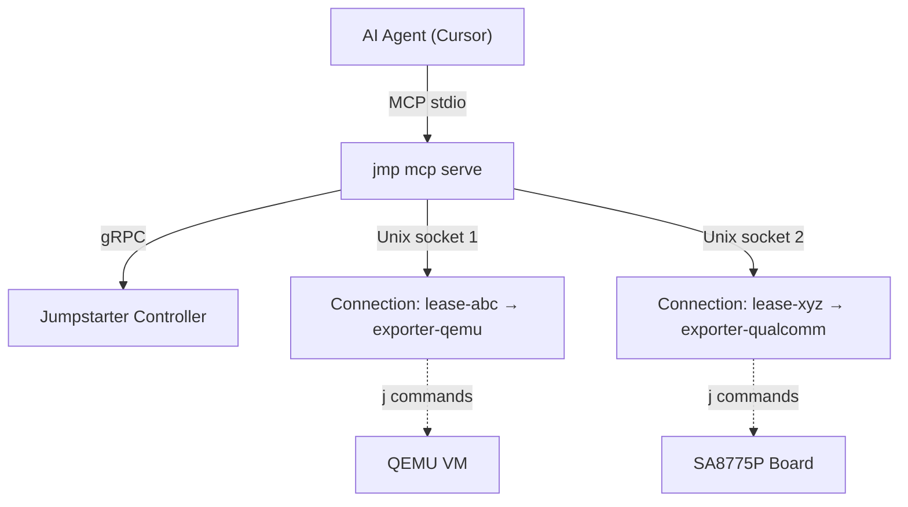

# Jumpstarter MCP Server for Agent Interaction

Build an MCP server into `jmp` that exposes lease management, persistent connections, command execution, and CLI tree exploration as structured tools -- making jumpstarter a first-class agent-accessible system.

## Architecture

The MCP server runs as a subprocess managed by Cursor (or any MCP-compatible host) via stdio transport. It manages connections as persistent in-memory state, so an agent can create a lease, connect, run many commands, and disconnect -- all through structured tool calls.



## Tools Exposed

### Lease Management

- **`jmp_list_leases`** `(selector?, show_all?)` -- Returns structured list of leases with name, client, exporter, duration, status
- **`jmp_create_lease`** `(selector?, exporter_name?, duration)` -- Creates a lease, returns lease ID and metadata
- **`jmp_delete_lease`** `(lease_id)` -- Releases/deletes a lease

### Connection Management (persistent background sockets)

- **`jmp_connect`** `(lease_id)` -- Acquires a lease, starts `serve_unix_async` in background, returns connection ID and a summary of available `j` commands (auto-explores the CLI tree)
- **`jmp_disconnect`** `(connection_id)` -- Tears down the background socket, cleans up
- **`jmp_list_connections`** `()` -- Lists active connections with their lease, exporter, socket path, uptime

### Command Execution

- **`jmp_run`** `(connection_id, command: string[])` -- Runs a `j` subcommand against the connection (e.g. `["power", "on"]` or `["ssh", "--", "uname", "-a"]`). Captures and returns stdout, stderr, exit code.
- **`jmp_get_env`** `(connection_id)` -- Returns the environment variables, paths, and instructions needed to interact with the connection independently (outside MCP). Returns:
  - `env` -- dict of env vars to set: `JUMPSTARTER_HOST`, `JMP_DRIVERS_ALLOW`, `_JMP_SUPPRESS_DRIVER_WARNINGS`
  - `python_path` -- path to the jumpstarter venv Python binary (has all jumpstarter packages importable)
  - `j_path` -- path to the `j` CLI binary
  - `venv_path` -- root of the jumpstarter venv
  - `site_packages` -- path to site-packages (for `sys.path` manipulation if needed)
  - `shell_example` -- ready-to-use shell command string (e.g. `JUMPSTARTER_HOST=/path j power on`)
  - `python_example` -- example Python snippet using the jumpstarter API via the venv

  This enables three agent usage patterns:
  1. **Direct shell**: run `j` commands via Shell tool with env vars (faster for many sequential commands)
  2. **Custom Python scripts**: write `.py` files using `import jumpstarter` and run with the venv Python
  3. **Hybrid**: use MCP for discovery/lifecycle, switch to direct execution for heavy work

### Discovery

- **`jmp_explore`** `(connection_id, command_path?: string[])` -- Walks the Click command tree programmatically via `client.cli()` introspection. Returns structured JSON: command names, help text, parameters (with types and defaults), and nested subcommands. If `command_path` is provided (e.g. `["storage"]`), drills into that subtree.
- **`jmp_drivers`** `(connection_id)` -- Introspects the live `client.children` driver object tree. Returns a flat list of all drivers with:
  - `path` -- dot-separated Python access path (e.g. `client`, `client.power`, `client.qemu.ssh`)
  - `class` -- fully qualified Python class name (e.g. `jumpstarter_driver_power.client.PowerClient`)
  - `description` -- driver description
  - `methods` -- list of method names
- **`jmp_driver_methods`** `(connection_id, driver_path: string[])` -- Inspects a specific driver client instance at the given path in the children tree (e.g. `["power"]` or `["storage"]`). Uses Python `inspect` to return detailed method information for all public methods defined on the concrete driver class (excluding inherited base class methods like `call`, `streamingcall`, `cli`). For each method returns:
  - `name` -- method name
  - `signature` -- full Python signature string (e.g. `(self, wait: int = 2)`)
  - `docstring` -- the method's docstring
  - `parameters` -- list of params with name, type annotation, default value
  - `return_type` -- return type annotation if present
  - `is_streaming` -- whether it uses `streamingcall` (generator-based)
  - `call_example` -- ready-to-use Python snippet (e.g. `client.children["power"].cycle(wait=5)`)

  This is the "API docs on demand" tool -- an agent can drill into any driver and get the exact method signatures needed to write Python automation code.

## Server Instructions (sent to agent on startup)

The MCP server would include an `instructions` field telling agents how to use jumpstarter effectively:

```
Jumpstarter provides remote access to physical hardware devices through a
controller that manages leases and exporters.

Typical workflow:
1. jmp_list_leases to see existing leases, or jmp_create_lease to get a new one
2. jmp_connect with the lease ID to establish a persistent connection
3. jmp_explore to discover what CLI commands are available for this device
4. jmp_run to execute commands (power control, SSH, serial, storage, etc.)
5. jmp_disconnect and jmp_delete_lease when done

Each device type exposes different commands. Always explore before assuming
what's available. Common patterns:
- Power: ["power", "on"], ["power", "off"], ["power", "cycle"]
- SSH: ["ssh", "--", "your", "command", "here"]
- Storage: ["storage", "flash", "/path/to/image"]

Connections are persistent -- create once, run many commands against it.

For deeper inspection:
- jmp_drivers shows the Python driver object tree (class names, descriptions, methods)
- jmp_driver_methods drills into a specific driver to show method signatures,
  docstrings, parameters, and ready-to-use call examples

For advanced/independent usage, call jmp_get_env to get the raw environment
variables and Python/j paths. This lets you:
- Run j commands directly in the shell (faster for batch operations)
- Write and execute Python scripts using the jumpstarter API
- The Python path returned points to a venv with all jumpstarter packages
  installed, so `import jumpstarter` just works
- Use jmp_driver_methods to get exact method signatures for Python code
```

## Implementation Plan

### New package: `jumpstarter-mcp`

Create as a new package in the monorepo at `packages/jumpstarter-mcp/` to keep the `mcp` SDK dependency isolated from the main CLI. Entry point would still integrate as `jmp mcp serve`.

- **Dependency**: `mcp` (the [official Python MCP SDK](https://github.com/modelcontextprotocol/python-sdk))
- **Also depends on**: `jumpstarter` (for `ClientConfigV1Alpha1`, `Lease`, `client_from_path`, etc.) and `jumpstarter-cli-common` (for config loading)

### Key files

- **`jumpstarter_mcp/server.py`** -- Main MCP server: tool registration, stdio transport setup, server instructions
- **`jumpstarter_mcp/connections.py`** -- Connection manager: maintains `dict[str, Connection]` mapping connection IDs to background `serve_unix_async` tasks, socket paths, and client references
- **`jumpstarter_mcp/tools/leases.py`** -- Lease CRUD tools wrapping `config.create_lease()`, `config.list_leases()`, `config.delete_lease()`
- **`jumpstarter_mcp/tools/commands.py`** -- `jmp_run` (subprocess with `JUMPSTARTER_HOST` env), `jmp_get_env` (returns env vars + paths for independent usage), and `jmp_explore` (Click tree introspection via `client.cli().commands`)
- **`jumpstarter_mcp/introspect.py`** -- Recursive Click command tree walker and driver tree introspector

### Connection lifecycle

When `jmp_connect` is called:

1. Load client config (same path as `jmp shell`)
2. Call `config.lease_async(lease_name=lease_id, ...)` to acquire the lease
3. Start `lease.serve_unix_async()` as a background anyio task
4. Wait for beforeLease hook to complete
5. Store `{connection_id, lease, socket_path, task}` in the connection manager
6. Run `jmp_explore` automatically and return the command tree summary

When `jmp_run` is called:

1. Look up connection by ID, get socket path
2. Run `j <command>` as a subprocess with `JUMPSTARTER_HOST` set to the socket path
3. Capture stdout/stderr with a timeout
4. Return structured result

When `jmp_disconnect` is called:

1. Cancel the background task (triggers afterLease hook + cleanup)
2. Remove from connection manager

### Environment export (`jmp_get_env`)

Returns everything an agent needs to bypass MCP and interact with a connection directly via shell or Python. Implementation is straightforward since all values are known at connection time:

```python
import shutil
import sys
import sysconfig

def get_env(connection):
    socket_path = connection.socket_path
    python_path = sys.executable  # venv Python running the MCP server
    j_path = shutil.which("j")
    venv_path = sys.prefix
    site_pkgs = sysconfig.get_paths()["purelib"]

    env_vars = {
        "JUMPSTARTER_HOST": socket_path,
        "JMP_DRIVERS_ALLOW": "UNSAFE" if connection.unsafe else ",".join(connection.allow),
        "_JMP_SUPPRESS_DRIVER_WARNINGS": "1",
    }

    return {
        "connection_id": connection.id,
        "env": env_vars,
        "python_path": python_path,
        "j_path": j_path,
        "venv_path": venv_path,
        "site_packages": site_pkgs,
        "shell_example": f'JUMPSTARTER_HOST={socket_path} j power on',
        "python_example": (
            f'#!{python_path}\n'
            f'import os\n'
            f'os.environ["JUMPSTARTER_HOST"] = "{socket_path}"\n'
            f'from jumpstarter.utils.env import env\n'
            f'with env() as client:\n'
            f'    client.children["power"].on()\n'
        ),
    }
```

The agent can then use the Shell tool directly:

```bash
JUMPSTARTER_HOST=/tmp/jmp-xyz/socket j ssh -- uname -a
```

Or write a Python script and run it with the venv Python:

```bash
/path/to/venv/bin/python3 my_automation.py
```

### Click tree introspection (`jmp_explore`)

Since `client.cli()` returns a `click.Group`, we can walk it without invoking any commands. This requires connecting a client to the socket first (to get the driver tree), then introspecting:

```python
def walk_click_tree(cmd, path=None):
    path = path or []
    result = {
        "name": cmd.name,
        "help": cmd.help,
        "params": [{"name": p.name, "type": str(p.type), "help": p.help, "required": p.required}
                   for p in cmd.params if not p.hidden],
    }
    if isinstance(cmd, click.Group):
        result["subcommands"] = {
            name: walk_click_tree(sub)
            for name, sub in cmd.commands.items()
        }
    return result
```

This would produce output like:

```json
{
  "name": "root",
  "help": "Qualcomm Ride SX 4 SA8775P Exporter",
  "subcommands": {
    "power": {"help": "Integrated Power control", "subcommands": {"on": {...}, "off": {...}, "cycle": {...}}},
    "ssh": {"help": "Run SSH command with arguments", "params": [{"name": "args", ...}]},
    "storage": {"help": "RideSX storage operations", "subcommands": {"flash": {...}, "dump": {...}}}
  }
}
```

### Driver tree introspection (`jmp_drivers`)

Flattens `client.children` into a list with dot-separated access paths:

```python
def list_drivers(client, prefix="client"):
    cls = type(client)
    results = [{
        "path": prefix,
        "class": f"{cls.__module__}.{cls.__qualname__}",
        "description": client.description,
        "methods": list(client.methods_description.keys()),
    }]
    for name, child in client.children.items():
        results.extend(list_drivers(child, f"{prefix}.{name}"))
    return results
```

Example output for a Qualcomm board:

```json
[
  {"path": "client", "class": "jumpstarter_driver_composite.client.CompositeClient", "description": "Qualcomm Ride SX 4 SA8775P Exporter", "methods": []},
  {"path": "client.power", "class": "jumpstarter_driver_power.client.PowerClient", "description": "Integrated Power control", "methods": ["on", "off", "cycle"]},
  {"path": "client.ssh", "class": "jumpstarter_driver_network.client.TcpNetworkClient", "description": "Run SSH command with arguments", "methods": []},
  {"path": "client.storage", "class": "some_driver.client.StorageClient", "description": "RideSX storage operations", "methods": ["flash", "dump"]}
]
```

### Driver method introspection (`jmp_driver_methods`)

Uses `inspect` to pull method details from a specific driver client. Navigates `client.children` by path, then inspects the concrete class:

```python
import inspect

# Methods defined on DriverClient base that should be excluded
BASE_METHODS = {m for m in dir(DriverClient) if not m.startswith("_")}

def get_driver_methods(client, driver_path):
    target = client
    for key in driver_path:
        target = target.children[key]

    cls = type(target)
    methods = []
    for name, method in inspect.getmembers(target, predicate=inspect.ismethod):
        if name.startswith("_") or name in BASE_METHODS:
            continue
        sig = inspect.signature(method)
        doc = inspect.getdoc(method)
        is_streaming = "streamingcall" in inspect.getsource(method)
        methods.append({
            "name": name,
            "signature": str(sig),
            "docstring": doc,
            "parameters": [
                {"name": p.name, "annotation": str(p.annotation), "default": str(p.default)}
                for p in sig.parameters.values() if p.name != "self"
            ],
            "return_type": str(sig.return_annotation),
            "is_streaming": is_streaming,
            "call_example": f'client.children["{driver_path[-1]}"].{name}()',
        })
    return {"class": f"{cls.__module__}.{cls.__qualname__}", "methods": methods}
```

Example output for `driver_path=["power"]` on a PowerClient:

```json
{
  "class": "jumpstarter_driver_power.client.PowerClient",
  "methods": [
    {"name": "on", "signature": "() -> None", "docstring": "Power on the device.", "parameters": [], "return_type": "None", "is_streaming": false, "call_example": "client.children[\"power\"].on()"},
    {"name": "off", "signature": "() -> None", "docstring": "Power off the device.", "parameters": [], "return_type": "None", "is_streaming": false, "call_example": "client.children[\"power\"].off()"},
    {"name": "cycle", "signature": "(wait: int = 2)", "docstring": "Power cycle the device.", "parameters": [{"name": "wait", "annotation": "int", "default": "2"}], "return_type": "<class 'inspect._empty'>", "is_streaming": false, "call_example": "client.children[\"power\"].cycle()"},
    {"name": "read", "signature": "() -> Generator[PowerReading, None, None]", "docstring": "Read power data from the device.", "parameters": [], "return_type": "Generator[PowerReading, None, None]", "is_streaming": true, "call_example": "client.children[\"power\"].read()"}
  ]
}
```

### Cursor integration

User adds to `~/.cursor/mcp.json`:

```json
{
  "mcpServers": {
    "jumpstarter": {
      "command": "jmp",
      "args": ["mcp", "serve"]
    }
  }
}
```

## Implementation Todos

1. Create `packages/jumpstarter-mcp/` package with pyproject.toml, dependencies on `mcp`, `jumpstarter`, `jumpstarter-cli-common`
2. Implement ConnectionManager class: connect/disconnect/list with background anyio tasks for `serve_unix_async` lifecycle
3. Implement `jmp_list_leases`, `jmp_create_lease`, `jmp_delete_lease` tools wrapping existing config API
4. Implement `jmp_connect`, `jmp_disconnect`, `jmp_list_connections` tools using ConnectionManager
5. Implement `jmp_explore` (Click CLI tree walker), `jmp_drivers` (flat driver list with path/class/description/methods), and `jmp_driver_methods` (inspect-based method introspection)
6. Implement `jmp_run`: subprocess execution of `j` commands with `JUMPSTARTER_HOST` env, stdout/stderr capture
7. Implement `jmp_get_env`: returns env vars, venv Python path, j path, site-packages path, and usage examples
8. Wire everything into MCP server with stdio transport, server instructions, and `jmp mcp serve` entry point
9. Add `jmp mcp` subcommand to main jmp CLI group in jumpstarter-cli
10. Test end-to-end: add to mcp.json, verify agent can list leases, create lease, connect, explore, run commands, disconnect

## Future Enhancements (out of scope for v1)

- **MCP Resources**: Expose `jumpstarter://leases` and `jumpstarter://connections/{id}/commands` as readable resources
- **Streaming**: Stream serial/console output as MCP notifications
- **SSH tunnel tool**: Return a local port forwarding to the device (for browser-based testing)
- **`--daemon` CLI flag**: Still useful for non-MCP automation (CI scripts); complementary to this work
