# Client → Exporter Architecture Mapping: Python vs. the Rust FFI Core

**Status:** Proposal / design reference
**Scope:** The client-to-exporter data path and the driver-hosting model — from the PyTest
framework, the `j` CLI, and `jmp shell` through the `jmp run` exporter process and the
multi-language driver subprocesses.
**Out of scope (by request):** the controller and router. Both have already been rewritten in
Rust; here they are treated as an opaque, authenticated byte relay so we can focus on the **Rust
FFI Core** and its multi-language driver/client model.

---

## 1. The two designs in one sentence

| | Original (Python) | Rust FFI Core (proposed) |
|---|---|---|
| **What runs the show** | A Python object graph on each side; grpcio/protobuf base classes | One Rust engine (`jumpstarter_core`) embedded in every language over UniFFI |
| **Driver language** | Python only | Python **and** Rust **and** JVM (Go/TS/C to follow) — mixed in one exporter |
| **Wire contract** | Generic `DriverCall(uuid, method_string, repeated Value)` — untyped, reflection-dispatched | Native per-interface gRPC; a real `.proto` service per interface, opaque bytes routed by UUID |
| **Type system** | `google.protobuf.Value` (JSON round-trip), method existence checked by string + magic marker | A self-contained `FileDescriptorSet` per driver is the single source of truth |
| **Client typing** | Hand-written `DriverClient`, imported by dotted Python path; both ends need the same package | Codegen emits idiomatic typed clients in every language from the proto |
| **Driver hosting** | In-process Python objects in the exporter process | One driver-host **subprocess per top-level entry**, federated by the hub |
| **Bulk byte plane** | `RouterService.Stream` gRPC frames | Shared-memory ring duplex (~1.7 GiB/s), gRPC only for control |
| **Business logic** | Duplicated per language (there is only one language) | Written **once** in Rust; bindings are thin |

The rest of this document makes each row precise, with the exact components and hops.

---

## 2. The original Python architecture

### 2.1 Shape

Everything driver-side is **Python objects living in a single Python process**. The only non-Python
components are the Go controller and router, which relay opaque bytes and never understand a driver
call. A driver is a `jumpstarter.driver.Driver` subclass (itself a grpcio `ExporterServiceServicer`),
discovered via setuptools entry points and instantiated by importing its dotted class path from the
exporter YAML `type:` field.

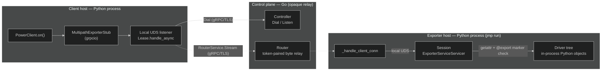

### 2.2 What a call actually is

`client.power.on()` becomes a single generic RPC, spoken end-to-end between the client stub and the
exporter `Session` (tunneled inside the router's opaque byte stream):

```text
DriverCallRequest { uuid = "<driver uuid>", method = "on", args = [ Value ... ] }
   → Session.DriverCall → self[uuid].DriverCall
   → getattr(driver, "on"), verify MARKER_MAGIC set by @export
   → decode_value(args) → await on() → encode_value(result)
   → DriverCallResponse { result = Value }
```

- **No per-driver IDL.** The wire messages are generic; arguments and returns survive only a
  Pydantic-`Any` → `google.protobuf.Value` JSON round-trip (`common/serde.py`).
- **Dispatch is reflection by string.** The method is found with `getattr` and validated by a magic
  marker attribute — there is no compile-time contract.
- **Streaming** (`power.read()`) uses `StreamingDriverCall` with the same Value codec.
- **Byte plane** (`@exportstream`, resources, serial consoles, image transfer) bypasses `DriverCall`
  and opens a `RouterService.Stream` bidi, encoding the request in gRPC initial metadata and framing
  payloads as `StreamRequest/StreamResponse`. Compression (gzip/xz/bz2/zstd) is negotiated in
  metadata.

### 2.3 Why it is Python-locked

1. **Drivers are Python classes** — every driver subclasses `Driver` (a grpcio servicer). No FFI, no
   subprocess/socket foreign-driver host exists anywhere in `driver/` or `exporter/`.
2. **Discovery is setuptools entry points** (`group="jumpstarter.drivers"`); instantiation is
   `import_class(type)` on a dotted Python path.
3. **The client class is a Python path too** — shipped in the `GetReport` label
   `jumpstarter.dev/client`; the client side does `import_class(...)` to build the matching
   `DriverClient`. **Both ends must have the same Python package installed.**
4. **The contract is dynamic** — a non-Python implementation would have to re-implement the untyped
   Value codec *and* the marker/reflection semantics, from no schema.
5. **grpcio/protobuf-bound** — the base classes themselves are grpc-generated servicer/stub types.

**Net:** a driver cannot be written in any language but Python, and even the "in-process" test path
(`serve()`) still spins up a real grpcio server + client over a Unix socket and exercises the Value
codec.

### 2.4 PyTest framework (original)

`jumpstarter_testing.pytest.JumpstarterTest` provides a class-scoped `client` fixture that either
connects to a live `jmp shell` (via `JUMPSTARTER_HOST`) or acquires a lease itself
(`config.lease(selector=...)`). For pure unit tests, `jumpstarter.common.utils.serve(MockPower())`
serves the driver tree on a temporary Unix socket and hands back a live `DriverClient` — the whole
gRPC/Value-codec stack, minus the controller.

### 2.5 The `jmp shell` and `j` process model (via UDS)

The original design uses the same shell/socket contract the Rust rewrite was later derived from — but
everything behind the socket is Python.

**The shell process (persistent).** `jmp shell` (`jumpstarter_cli/shell.py`) acquires a lease and calls
`Lease.serve_unix_async()` (`client/lease.py`), which opens a `TemporaryUnixListener` whose handler
`Lease.handle_async` does the controller `Dial` and bridges each accepted connection to the exporter
through the router. It then `launch_shell(...)` (`common/utils.py`) execs the user's shell with
`JUMPSTARTER_HOST=<unix socket>` and `JMP_DRIVERS_ALLOW=...`. This process holds the lease and runs the
status/log monitors and the hook lifecycle for the whole session. (Local-exporter mode serves an
in-process `Session` on the same socket, with no controller/router.)

**Each `j <driver> <cmd>` (ephemeral, single Python process).** `j` (`jumpstarter_cli/j.py`) is a
console-script; each invocation is a fresh Python process, child of the interactive shell. Via
`env_async` it reads `JUMPSTARTER_HOST`, opens **one** connection to the UDS, fetches the report, and
builds the **entire** `DriverClient` tree; `client.cli()` returns a Click group assembled dynamically
from that live tree, and the requested subcommand (`power on`) dispatches **in-process** as a
`DriverCall` (§2.2). If `JUMPSTARTER_HOST` is unset it errors with "the j command must be used inside a
jmp shell." There is **no per-driver language routing** — a single Python process owns the whole client
tree because every client is Python.

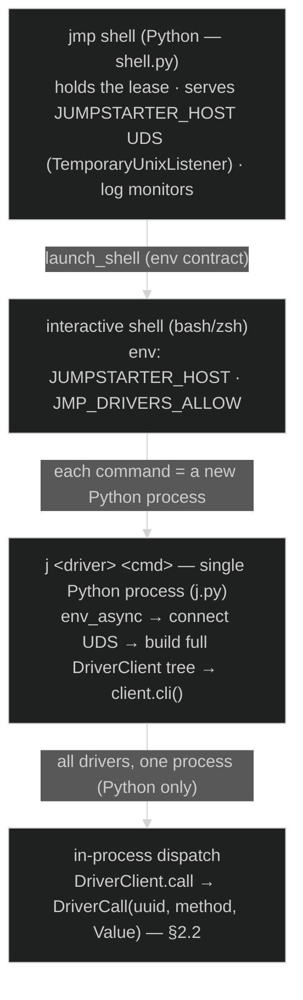

The UDS tunnel itself is the same shape the Rust design later kept:

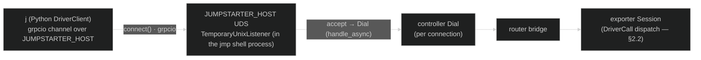

**What changes in the Rust design (§3.7):** the socket/lease/tunnel contract
(`JUMPSTARTER_HOST` UDS → `Dial` → router bridge → exporter) is **identical** — the Rust `TransportHost`
is a direct port of `serve_unix_async`/`handle_async`. Two things differ behind it: (1) `j` becomes a
thin *language router* that hands each driver off to the owning language's client CLI instead of one
Python process owning the whole tree, and (2) the wire call is native per-interface gRPC instead of a
generic `DriverCall`.

---

## 3. The Rust FFI Core architecture

### 3.1 The core idea

**Write everything hard once, in Rust; make every language a thin binding.** The session, lease
lifecycle, auth, routing, the demux, the shared-memory byte plane, compression, and the descriptor
codec all live in Rust and are exposed over UniFFI as the `jumpstarter_core` module. Each language
brings only (a) its own idiomatic gRPC stubs / typed clients and (b) a driver implementation — never
its own transport, session, or routing.

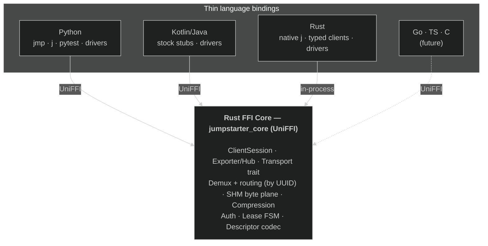

### 3.2 Crate map (the FFI-core boundary)

| Crate | Owns |
|---|---|
| `jumpstarter-client` | `ClientSession` (`native_unary`, `native_server_stream`, `driver_call`, `stream`), `DriverReportIndex`, `ControllerSession`, `LeaseTransport` |
| `jumpstarter-exporter` | The hub/exporter runtime: `exporter.rs` (`run`), `session.rs` (`serve_native_host`, `RoutingTable`, `SessionRouter` demux fallback), `polyglot.rs` (`PolyglotHostFactory`), `routing.rs` (`RoutingBackend`), `shm_backend.rs` (`ShmChannelBackend`), lease FSM |
| `jumpstarter-transport` | The `DriverBackend` trait + `ChannelBackend`; `demux.rs` (`BytesCodec` identity codec, `Demux` routing by `x-jumpstarter-driver-uuid`); `transport.rs` (`Transport` trait: in-process / SHM / network — "tonic over a swappable byte duplex") |
| `jumpstarter-shm` | `Ring` (mmap SPSC ring), `ShmDuplex` (`AsyncRead`+`AsyncWrite` over a ring pair) — the byte plane |
| `jumpstarter-driver-core` | The binding-agnostic foreign seam: `DriverApi`, `ForeignDriver`, `DynamicBackend` (serves native gRPC dynamically from a `DescriptorPool` — no generated servicer), `legacy.rs` (old-client shim) |
| `jumpstarter-core-uniffi` | The UniFFI surface (extension module `jumpstarter_core`): the foreign traits, exported entry points, and the `ClientSession`/stream objects |
| `jumpstarter-codec` | The descriptor codec (`encode_request`/`decode_response`, `build_native_table`) |
| `jumpstarter-codegen` | Proto-first codegen: `.proto`/`FileDescriptorSet` → typed clients + device wrappers |
| `jumpstarter-driver` | The Rust driver-host SDK (`serve_driver`, `host_main!`, `#[driver]`) |
| `jumpstarter-cli` | The pure-Rust `jmp` command tree (`dispatch(args) -> u8`) |

> Note vs. earlier internal notes: there is **no `jumpstarter-core` crate** — the client session is
> `jumpstarter-client`, the seam is `jumpstarter-driver-core`, and the UniFFI extension module named
> `jumpstarter_core` is built from `jumpstarter-core-uniffi`.

### 3.3 The UniFFI surface

Exposed to Python/Kotlin (from `jumpstarter-core-uniffi/src/lib.rs`):

- **Foreign traits** (implemented in the language, called by Rust) — `#[uniffi::export(with_foreign)]`:
  - `DriverHostFactory` → `new_host() -> Arc<dyn DriverHost>`
  - `DriverHost` → `describe`, `driver_call`, `forward_unary` / `forward_server_stream`, byte-stream ops
- **Exported entry points** — `run_exporter`, `run_exporter_polyglot`, `serve_driver_host(uds, factory)`,
  `run_cli(args) -> u8`, plus sync config helpers.
- **Exported objects** the languages call *into* — `ClientSession`, `ClientByteStream`,
  `ClientResultStream`, `ClientNativeStream`, `ControllerSession`, `LeaseTransport`, `LeasedExporter`,
  `StreamCompressor`/`StreamDecompressor`.
- **Records** — `DriverNode { ..., descriptor_set: Option<Vec<u8>> }` (the per-driver
  `FileDescriptorSet`), errors, config specs.

### 3.4 Client → exporter: the native gRPC path

The generic `DriverCall`/`Value` codec is **gone** as a dispatch path (it survives only as a
server-side translation shim for legacy clients). Native per-interface gRPC is the only path.

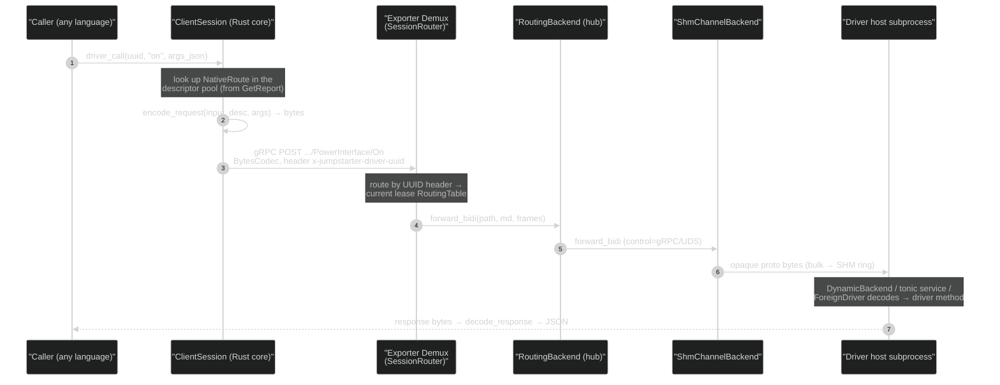

Key properties:

- **Opaque, identity-coded bytes.** `BytesCodec` never parses the per-driver proto; the core forwards
  raw message bytes and only the endpoints (client encode, driver decode) touch the schema.
- **Routing by UUID header.** `x-jumpstarter-driver-uuid` selects the backend via the lease's
  `RoutingTable`; the exporter's typed `ExporterService`/`RouterService` remain, and any
  `jumpstarter.driver.*` path falls through to the `Demux`.
- **Every call is framed as bidi-streaming** — the most general HTTP/2 shape — so unary,
  server-streaming, and client-streaming clients all read it identically and no uplink is truncated.
- **Descriptors are the contract.** Each driver ships a self-contained `FileDescriptorSet`
  (interface file + transitive well-known-type deps, deps-first) in `DriverNode.descriptor_set`; the
  client merges them into one `DescriptorPool` once, so the advertised wire and the decoded wire can
  never diverge.

### 3.5 `jmp run`: polyglot driver dispatch

`jmp run` always hosts drivers through the polyglot hub (`PolyglotHostFactory`); the hub itself
embeds no language runtime. Per **top-level `export:` entry**, it picks a runtime, spawns **one
driver-host subprocess**, streams a single-entry config on that host's **stdin**, and federates the
entries under a synthesized root via `RoutingBackend`. Different languages coexist in one config.

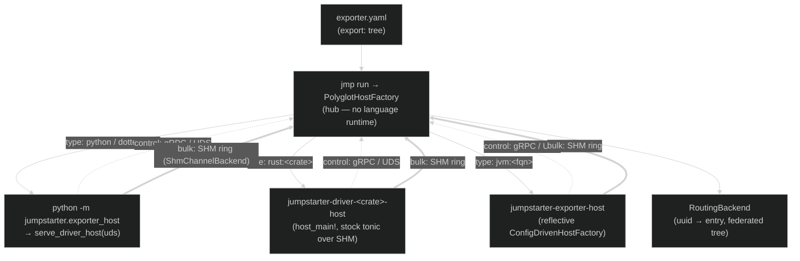

- **Runtime selection** (`effective_runtime`): explicit `runtime:` wins; else inferred from `type:` —
  `rust:<crate>` → rust, `jvm:<fqn>` → jvm, else python. A per-entry `host:` launcher overrides
  everything for any runtime.
- **Host resolution policy:** prefer a prebuilt artifact; in a local dev workspace, build then exec
  the artifact directly (never `cargo run`/`gradlew run`, which would break the parent-death
  watchdog).
- **Lifecycle:** each host serves on a private UDS, self-reaps via `JMP_HUB_PID`, and is SIGKILLed at
  lease teardown. The bulk byte plane rides an SHM ring; only low-volume control gRPC uses the UDS.

### 3.6 The multi-language seam (both directions)

Foreign languages plug into the same core on **both** sides. The unifying trick on the client side is
**"steal the transport"**: a language uses its own stock protoc/gRPC stubs, but the channel underneath
is a custom channel that marshals opaque bytes across UniFFI into the Rust `ClientSession`. The
language never opens a socket to the exporter.

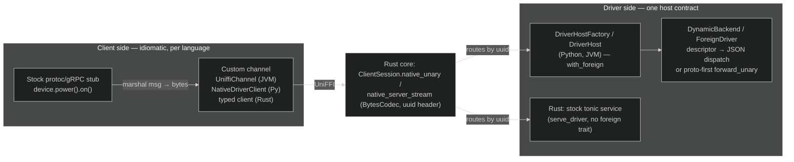

- **Client side.** Kotlin/Java: `JumpstarterChannel : io.grpc.Channel` whose `ClientCall` marshals the
  stub's own `MethodDescriptor` to bytes and calls `session.nativeUnary(...)`. Python:
  `NativeDriverClient` encodes args via `proto_marshal` and calls `session.native_unary`. Rust: the
  generated typed client drives `session.native_unary` directly. Same opaque byte hop, one codec.
- **Driver side.** Python/JVM implement the `DriverHost` foreign trait; `ForeignDriver` +
  `DynamicBackend` decode the driver's `FileDescriptorSet` and dispatch (or take a proto-first
  `forward_unary` fast path). Rust drivers skip the foreign trait entirely and serve a stock tonic
  service over an SHM transport.

The result: **JVM client ↔ Python driver, Python client ↔ Rust driver, any combination** — all
through one Rust core, one wire contract, one codec.

### 3.7 `jmp shell` and the `j` subprocess model (via UDS)

Inside a `jmp shell`, driver commands are run with the `j` CLI. `j` is **not part of the shell
process** — it is a fresh subprocess per invocation, and it reaches the exporter only through the one
thing the shell exports: the `JUMPSTARTER_HOST` Unix socket.

**The shell process (persistent).** `jmp shell` (pure Rust, `jumpstarter-lease`) acquires or reuses a
lease, then stands up a `TransportHost` — a temporary local UDS at `/tmp/jmp-<pid>-*/sock` — and
exports its path as `JUMPSTARTER_HOST` (plus `JMP_DRIVERS_ALLOW` and the exporter-context vars) into
the interactive shell it spawns. It also streams exporter logs. This process stays alive for the whole
session, **holding the lease**; on exit it runs `EndSession`/`afterLease` and releases the lease
(unless it was reused). The UDS is a **tunnel, not the exporter**: every accepted connection is
independently `Dial`ed via the controller and bridged through the router to the exporter session
(`transport.rs` `Bridge::handle` → `router::bridge`). In direct mode (`--tls-grpc HOST:PORT`) there is
no UDS — `JUMPSTARTER_HOST` is a TCP endpoint and clients connect straight to the standalone exporter.

**Each `j <driver> <cmd>` (ephemeral).** A fresh process, child of the interactive shell. Native `j`
(`jumpstarter-client-cli`) opens a `ClientSession` to the UDS, calls `GetReport`, and looks up the
named driver's `jumpstarter.dev/client` label. It then **routes by client language**, re-exec'ing the
owning language's client CLI — each of which re-reads `JUMPSTARTER_HOST` and opens *its own* UDS
connection:

- `rust:<crate>` → the per-crate `<crate>-client` binary (native typed client, in-process gRPC)
- `jvm:<fqn>` → `jumpstarter-jvm-client` (picocli `dev.jumpstarter.cli.JMain`)
- Python client / unknown driver / top-level help / `introspect` → `python -m jumpstarter_cli.j`

The delegated client then drives the driver over **native gRPC** (`native_unary` /
`native_server_stream`, see §3.4) across its own UDS connection.

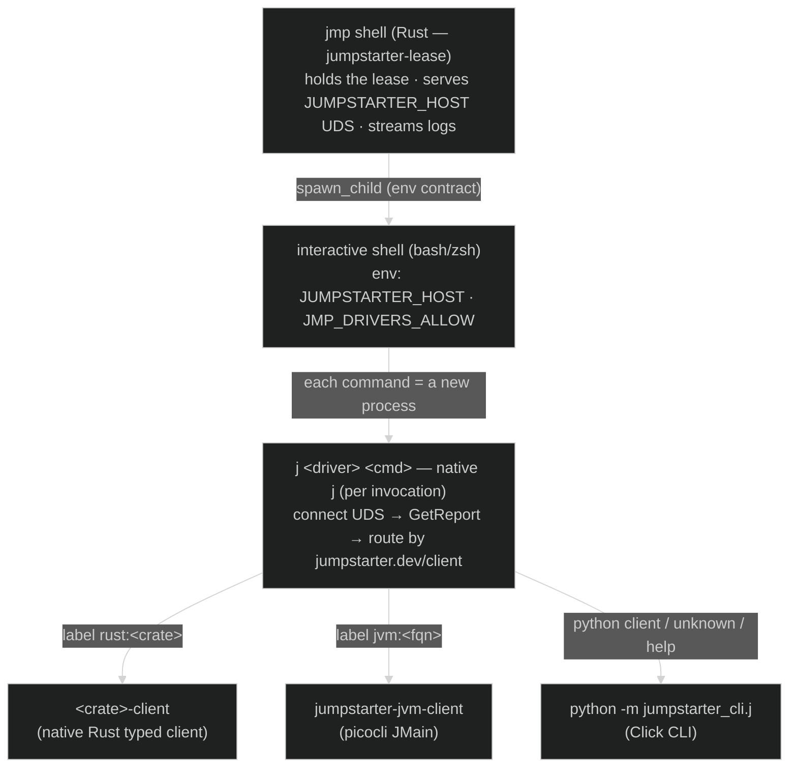

Every one of those client processes reaches the exporter the same way — a fresh connection to the one
exported socket, which the shell process tunnels to the exporter:

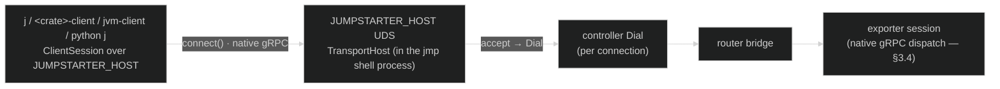

**Key properties:**

- **The shell process is a language-agnostic local gateway.** All the hard parts — lease, `Dial`,
  router bridge, TLS — live in the one Rust `jmp shell` process; the `j` subprocesses only speak native
  gRPC to the exported socket and never touch the controller/router directly.
- **`j` is a language router.** The same `j power on` works whether power's client is Rust, JVM, or
  Python — `j` reads the owning language from the report and hands off; only the leaf client CLI is
  language-specific. (Native `j` still delegates top-level help and `introspect` to the Python `j`.)
- **Connections are independent and stateless.** Each `j` invocation (and each delegated client) opens
  its own UDS connection → its own `Dial` → its own router bridge. The durable state is the lease held
  by `jmp shell`; the `j` processes come and go.

**Contrast with the original design (§2.5).** The socket/lease/tunnel contract is identical — the Rust
`TransportHost` is a direct port of the Python `serve_unix_async`/`handle_async`. What differs is what
sits behind it: old `j` was a **single Python process** that built the whole `DriverClient` tree and
dispatched `DriverCall` in-process, whereas native `j` is a thin **language router** that hands off to
the owning language's typed client over native gRPC. Same socket, polyglot instead of Python-only.

---

## 4. Codegen and Protobuf interfaces

The `.proto` is the single source of truth, and codegen is **proto-only — it never loads driver
code.**

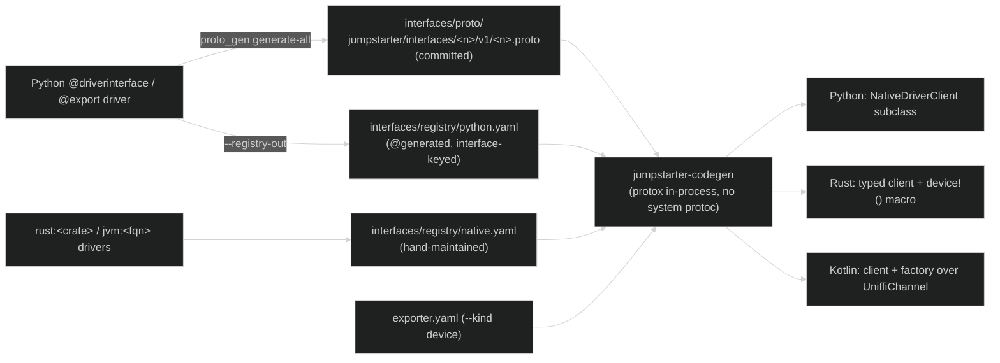

- **The `interfaces/` package** holds committed per-interface protos
  (`jumpstarter.interfaces.<name>.v1.<Name>Interface`) plus an **interface-keyed registry**:
  `python.yaml` (`@generated` — maps each driver `type:` to its interface FQN and optional custom
  client) and `native.yaml` (hand-maintained, for `rust:`/`jvm:` types). `buf.yaml` lints; `buf.gen.yaml`
  is a seed with no active plugins today (JVM stubs come from the per-module Gradle protobuf plugin).
- **Two codegen kinds.** Interface codegen (`--kind client`/`stub`) emits typed clients / driver
  stubs from a proto or descriptor set. Device codegen (`--kind device`) takes an `exporter.yaml` +
  the registry + proto root, resolves every node to its interface **without loading driver code**
  (explicit `interface:` key → registry `type:` lookup → opaque/skip), and emits a typed **device
  wrapper** mirroring the configured tree. The generated class *is* the root driver client — no
  wrapper hop.
- **Descriptor shipping.** A Python driver's `@export` surface is introspected into a self-contained
  `FileDescriptorSet` (`descriptor_builder.build_file_descriptor_set`) and shipped via the UniFFI
  `describe()` → `DriverNode.descriptor_set` seam; the Rust core assembles the report and both ends
  decode against the same set. Rust advertises `proto::FILE_DESCRIPTOR_SET`; JVM uses
  `DescriptorSets.selfContained(...)`.

### 4.1 Zero-boilerplate driver authoring

| Language | What the author writes | Mechanism |
|---|---|---|
| **Rust** | `#[jumpstarter_driver::driver(client="…")] impl PowerInterface for MockPower`; `main.rs` is one line: `host_main!(<crate>)`; `lib.rs` is `interface!("…")` | `#[driver]` auto-registers via `inventory`; `host_main!` → `Host::from_inventory().run()` |
| **JVM** | Implement the stock gRPC service base + `@JumpstarterDriver(client="…")`; apply one gradle plugin | Reflective `ConfigDrivenHostFactory` + `dev.jumpstarter.driver-host` plugin ships both start scripts |
| **Python** | Subclass the generated `ProtoInterface` base | `__init_subclass__` auto-`@export`s each implemented RPC; `python -m jumpstarter.exporter_host` serves it |

---

## 5. Testing across languages

The PyTest story is preserved and now runs through the **same** dispatch the real exporter uses, and
each language ships a matching one-call `serve()` harness.

- **Python** — `jumpstarter.common.utils.serve(root)` wraps the tree in a `DriverHost` and presents it
  via `LocalSession` through the same `ClientSession` interface the Rust core exposes: it exercises
  the exact FFI-shaped dispatch (introspection, codec, handle-based streams) **without** grpc or a
  socket. `JumpstarterTest` still provides the class-scoped `client` fixture for live-lease tests.
- **Rust** — `jumpstarter-driver-harness::serve(...)` stands the driver up over the **real** transport
  (`serve_driver` over SHM, federated through the production `serve_native_host`) and connects a
  `ClientSession`, so the author drives the generated typed client through the full
  client → exporter → SHM → tonic loop.
- **JVM** — `DriverHostServer.serve(uds, factory)` + `ExporterSession.connect(uds)` drives the
  generated `ExampleRig(session)` over UDS via UniFFI.

Each harness serves a driver over the real host seam and drives it through the generated typed client
— proving both directions of interop with no bespoke test transport.

---

## 6. Component mapping (old → new)

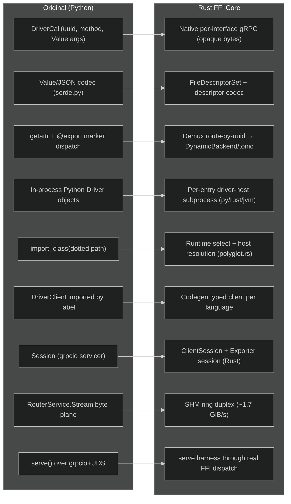

---

## 7. Why the new design wins (the proposal payoff)

1. **One implementation of everything hard.** Session, lease FSM, auth, routing, the demux, the SHM
   byte plane, compression, and the codec live **once** in Rust. In the old design there is only one
   language *because* re-implementing all of that per language was infeasible. The FFI core makes new
   languages cheap: a binding is stubs + a driver impl, not a second protocol stack.

2. **True multi-language, mixed in one exporter.** Drivers **and** clients can be Python, Rust, or JVM
   (Go/TS/C to follow), and a single `exporter.yaml` can host a mix — each entry in its own subprocess,
   federated by UUID. A JVM client can drive a Python driver and vice-versa. The old design required
   the *same Python package on both ends*.

3. **Typed contracts instead of stringly-typed reflection.** A real per-interface gRPC service plus a
   self-contained `FileDescriptorSet` is the single source of truth, replacing
   `method: string` + `repeated Value` dispatched by `getattr` + a magic marker. Schema drift between
   the advertised and decoded wire is structurally impossible.

4. **Native gRPC APIs, idiomatic per language.** Because the core "steals the transport," each language
   uses its **own stock protoc stubs** — `device.power().on()` in Kotlin, a typed `PowerClient` in
   Rust, a `NativeDriverClient` subclass in Python — while the transport, routing, and byte plane stay
   in the Rust core. Codegen produces those clients from the same proto.

5. **Performance.** The SHM ring byte plane sustains ~1.7 GiB/s for bulk transfers, the native call
   path benchmarks at or above the Python baseline, and the `Transport` trait (in-process / SHM /
   network) collapses the redundant local socket hops of the old design.

6. **Fault isolation with zero boilerplate.** Per-driver subprocesses isolate crashes; a driver author
   writes a one-line host (Rust `host_main!`, Python `ProtoInterface`, JVM one gradle plugin) and
   nothing else.

7. **Testing parity.** The PyTest framework is preserved and now runs through the exact FFI dispatch
   the real exporter uses, and every language ships a matching one-call `serve()` harness — so a driver
   is verified end-to-end through the production path, in any language.

8. **One networking stack, not N.** All I/O — HTTP/2, TLS, UDS, streaming, flow-control, compression,
   reconnection, the router tunnel, the SHM byte plane — is unified under a single Rust stack
   (tonic/hyper/rustls/tokio) instead of each language's own gRPC quirks (grpc-java's native-UDS +
   executor deadlocks, grpcio's c-ares/`fork` fragility, grpc-js's pure-JS ceiling). Every language gets
   identical wire behavior, one security surface to patch, and new transport features for all languages
   at once — while keeping its own idiomatic API surface. See §8.4.

---

## 8. Design alternative considered: thin per-language clients and hosts vs. the FFI core

A natural question: instead of embedding the Rust core in every language, why not give each language a
**plain native gRPC client** (and a plain native **driver host**) that speaks the same native
per-interface wire directly — the client over the `jmp shell` UDS, the host as a subprocess the hub
federates? The wire is stock gRPC, so the stubs already exist. Two things make this more expensive than
it looks, and the second — the exporter side — is decisive.

### 8.1 The client side isn't as thin as it looks (macOS UDS bites the JVM)

The wire being stock gRPC means a native client *can* dial the `jmp shell` UDS — but **UDS support per
language is uneven, and the JVM is the worst case**: grpc-java has no pure-Java UDS; it needs Netty's
native `kqueue` transport on macOS (per-OS/arch classifiers) or `junixsocket`. So the "no native
dependency" appeal is already false on the JVM — you trade the Rust cdylib for netty-kqueue and inherit
macOS `sun_path` length + local-credential quirks. Under the FFI core, Rust/tokio owns the socket and
the JVM opens none, so that class of problem disappears (Go/Node/Python have clean native UDS and are
unaffected).

Inside a shell the Rust gateway already offloads lease/Dial/router, so a thin client there
re-implements "only" the codec + byte-plane framing + compression + UDS transport. But a **programmatic
client library used outside a shell** must implement the full controller flow (lease, Dial, router
bridge, auth, reconnect) itself — exactly what `ControllerSession`/`LeaseTransport` give every language
for free.

### 8.2 The exporter side doubles it — and that is the decisive cost

A **multi-language exporter means drivers in different languages**, and every one must be **hosted** —
served as a native gRPC service the hub spawns and federates (§3.5). So the same per-language transport
work is required a **second time, on the driver-host end**, which is the harder half:

- The **hub↔host byte plane is *always* SHM** (`ShmChannelBackend`), unlike the client hop which is
  often network. A thin-native host would re-implement the mmap SHM ring (+ idle wakeup, liveness) in
  each language — which itself needs native code (JNI/FFI), so the "pure-language host" is a mirage
  exactly where throughput matters most (multi-GiB/s flasher/image transfer).
- Each host also re-implements: serving the native gRPC service, descriptor introspection →
  self-contained `FileDescriptorSet`, `GetReport`/`describe`, the lifecycle contract (`--serve <uds>`,
  config-on-stdin, `JMP_HUB_PID` watchdog, SIGKILL teardown), compression, `@exportstream`/resource
  byte channels.
- The **hub itself stays Rust regardless** — nobody re-writes federation + routing + the lease FSM N
  times. So thin-native doesn't remove the Rust core from the exporter; it just fails to *reuse* it in
  the per-language hosts. You end up with a Rust hub **plus** N re-implemented host transports.

Under the FFI core, each per-language host is `serve_driver_host(uds, factory)` (embedded Rust core) +
a thin `DriverHost` foreign impl (Python/JVM) or a stock tonic service (Rust). The SHM serving, the
hub↔host contract, the demux/dispatch, and the lifecycle are all Rust, shared. The language writes only
the driver + a factory.

| Concern | Thin native (per language, both ends) | FFI core |
|---|---|---|
| Client transport (UDS/TCP + session) | per language; JVM needs netty-kqueue on macOS | Rust `ClientSession` |
| Lease / Dial / router bridge (standalone client) | per language | Rust `ControllerSession` / `LeaseTransport` |
| Host serving (native gRPC service) | per language | Rust `serve_driver_host` + thin `DriverHost` |
| Hub↔host SHM byte plane | per language (needs native code anyway) | Rust `ShmChannelBackend` (shared) |
| Descriptor introspection → `FileDescriptorSet` | per language (small) | per language (small) — same either way |
| Host lifecycle (`--serve`, stdin cfg, watchdog) | per language | Rust `run_host` |
| Hub (federation, routing, lease FSM) | Rust anyway | Rust |
| **Distinct hard transport impls to maintain** | **up to 2×N** | **1** |

### 8.3 The count that decides it: one implementation vs. 2×N

Client-side and host-side transport code don't share (different gRPC roles, opposite byte-plane
direction), and neither shares across languages. So:

- **FFI core:** **1** hard transport implementation (Rust), reused by **2 ends × N languages** — and
  every language gets the SHM fast path, identical semantics, and clean macOS UDS for free.
- **Thin native:** up to **2 × N** hard transport implementations (a client stack *and* a host stack
  per language), each re-porting SHM + byte plane + codec + lifecycle, each drifting, each fixed N
  times — on top of a Rust hub you keep anyway.

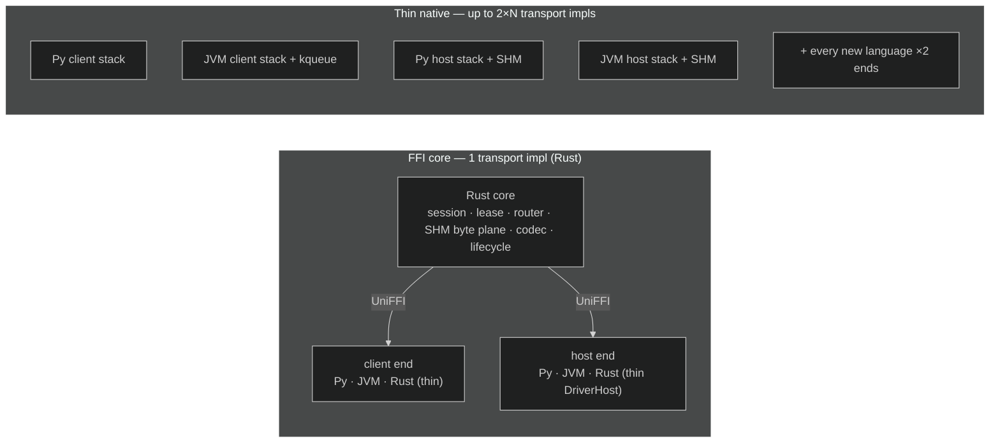

### 8.4 The underlying win: one networking stack instead of N

The thin-native approach does not just multiply *code* — it inherits **N sets of networking quirks**,
because every language's gRPC / HTTP2 / TLS stack behaves differently. Unifying all I/O under one Rust
stack (tonic + hyper + rustls + tokio) is the deeper reason the FFI core wins, and it is worth stating
on its own.

**Real quirks the polyglot stack has already hit (or would):**

- **grpc-java / Netty** — no pure-Java UDS (needs netty-kqueue/epoll native libs); the blocking stub's
  `ThreadlessExecutor` deadlocks unless callbacks are delivered on the call executor (we hit exactly
  this bringing up the JVM client); protobuf-java/grpc-java version-shading conflicts; TLS via JSSE or
  yet another native lib (netty-tcnative/BoringSSL).
- **Python / grpcio** — a heavy C-extension over grpc-core whose **c-ares resolver could not resolve the
  nip.io controller hostname** in our own benchmark; **grpcio + `os.fork` is famously fragile** (and the
  exporter forks); asyncio-vs-threads + GIL offloading. The Python impl even **split into dual sockets**
  (main + hook) to dodge TLS frame corruption — a workaround that exists only because of one stack's
  behavior.
- **Node / @grpc/grpc-js** — a pure-JS HTTP/2 impl with its own backpressure and performance ceiling;
  **Go** is clean but still ships its own HTTP/2 defaults.

Each of these carries different defaults for flow-control windows, keepalive/ping, max message size,
compression negotiation, metadata casing, reconnection/backoff, deadline propagation, and TLS — which is
why *"works from Python, times out from Java"* is a real failure mode in polyglot gRPC.

**Unifying on Rust collapses all of that:**

- **One HTTP/2 + gRPC engine (tonic/hyper)** → identical wire behavior for every language; the interop
  matrix goes from N×N library pairs to **1**. A Kotlin-client → Python-driver call is byte-identical on
  both ends *by construction*, not by testing every pairing.
- **One TLS stack (rustls)** → consistent certs/ALPN/ciphers, no per-language native TLS lib, and the
  dual-socket TLS workaround becomes unnecessary.
- **One UDS implementation (tokio)** → portable macOS/Linux, no netty-kqueue/junixsocket.
- **One security surface** → a single networking codebase to audit and patch; one `cargo update` instead
  of chasing CVEs across grpcio (+ c-ares/BoringSSL), grpc-java (+ netty-tcnative), grpc-js, and grpc-go.
- **One place for the hard parts** → reconnection, backoff, cancellation, streaming flow-control,
  compression, the SHM byte plane, the router tunnel, auth/metadata — hardened once.
- **Feature velocity** → a new transport capability (a codec, mTLS, HTTP/3/QUIC, a new router mode) ships
  once in Rust and every language gets it at the same time, not as an N-language port gated on the
  slowest ecosystem.
- **Performance is a property of the core, not a lottery** → no language is stuck on a slow HTTP/2 impl;
  every binding rides the same optimized transport + SHM fast path.

The languages keep their idiomatic **API surface** (stock stubs, typed clients, `device.power().on()`)
but delegate all the **networking** to one memory-safe, high-performance Rust stack — so the network
layer is written, hardened, secured, and optimized **once**, and every language inherits it.

### 8.5 Where a thin native client still fits

One shape is genuinely well-served by a plain client and costs almost nothing to offer, precisely
because the wire is stock gRPC: a **client-only consumer talking TCP to a standalone/direct exporter**
(a Go/Node/Python CI job with clean native networking, no hosting, no SHM, no lease-through-controller).
Point stock stubs at a real TCP channel and they work. That is a fine *optional* extra — but not the
mechanism for the shell/UDS path, and never for driver hosting.

### 8.6 Recommendation

Keep the **FFI core as the one transport on both ends.** It is the only option that gives uniform
behavior, the SHM byte plane everywhere, a symmetric client + host story, and painless macOS UDS — and
it makes the JVM *easier*, not harder, since Rust owns the socket. Offer a **thin native TCP client**
only as a lightweight, client-only convenience for languages with clean native networking. The
thin-native-everywhere alternative trades "one hard problem solved once in Rust" for "the same hard
problem solved up to 2×N times, plus a JVM/macOS UDS headache, plus a Rust hub you still maintain."
